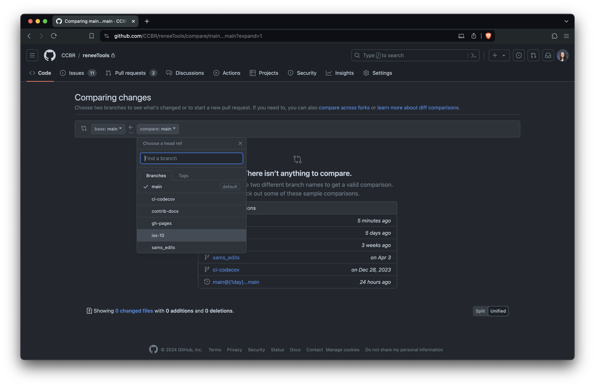
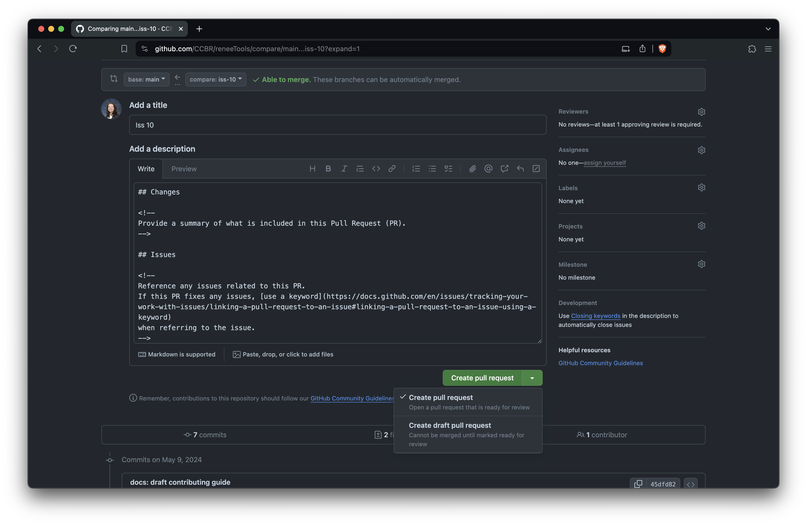

# Contributing to reneeTools

## Proposing changes with issues

If you’ve found a bug, please file an issue that illustrates the bug with a minimal
[reprex](https://www.tidyverse.org/help/#reprex) (this will also help you write a unit test, if needed).
If you want to make a change, it's a good idea to first [open an issue](https://code-review.tidyverse.org/issues/)
and make sure someone from the team agrees that it’s needed.

If you've decided to work on an issue,
[assign yourself to the issue](https://docs.github.com/en/issues/tracking-your-work-with-issues/assigning-issues-and-pull-requests-to-other-github-users#assigning-an-individual-issue-or-pull-request)
so others will know you're working on it.

### Pull request process

- If you are a member of [CCBR](https://github.com/CCBR),
  you can clone this repository to your computer or development environment.
  Otherwise, you will first need to [fork](https://docs.github.com/en/pull-requests/collaborating-with-pull-requests/working-with-forks/fork-a-repo) the repo and clone your fork.
  You only need to do this step once.

  ```sh
  git clone https://github.com/CCBR/reneeTools
  ```

  > Cloning into 'reneeTools'...
  > remote: Enumerating objects: 1136, done.
  > remote: Counting objects: 100% (463/463), done.
  > remote: Compressing objects: 100% (357/357), done.
  > remote: Total 1136 (delta 149), reused 332 (delta 103), pack-reused 673
  > Receiving objects: 100% (1136/1136), 11.01 MiB | 9.76 MiB/s, done.
  > Resolving deltas: 100% (530/530), done.

  ```sh
  cd reneeTools
  ```

- In an R console, Install all development dependencies with `devtools::install_dev_deps()`, and then make sure the package passes R CMD check by running `devtools::check()`.
  If R CMD check doesn't pass cleanly, it's a good idea to ask for help before continuing.

- Create a Git branch for your pull request (PR). Give the branch a descriptive name for the changes you will make, such as `iss-10` if it is for a specific issue.

  ```sh
  # create a new branch and switch to it
  git branch iss-10
  git switch iss-10
  ```

  > Switched to a new branch 'iss-10'

- Make your changes, write unit tests, and update the documentation as needed.

  Most changes to the code will also need unit tests to demonstrate that the changes work as intended.
  Use [`testthat`](https://testthat.r-lib.org/) to create your unit tests and test the code.
  Test files are organized as described in <https://style.tidyverse.org/tests.html>.
  Take a look at the existing code in this package for examples.

  If you have written a new function or changed the API of an existing function, you will need to update the function's roxygen2 comment.
  See instructions on writing roxygen2 comments here: <https://r-pkgs.org/man.html>.
  If the function is used in a vignette, you may also need to update the vignette.

  Run `devtools::check()` to make sure the package still passes R CMD check.

- Commit your changes to git and push your changes to GitHub.
  Your commit messages should follow the [conventional commits](https://www.conventionalcommits.org/en/v1.0.0/) format.
  Optional: you can use [`pre-commit`](https://ccbr.github.io/HowTos/GitHub/howto_precommit/)
  to enforce that your commits follow this format, as well as other code style checks.

  ```sh
  git add path/to/changed/files
  git commit -m 'feat: create function for awesome feature'
  ```

  > [iss-10 9ff256e] chore: demo git commands
  > 1 file changed, 22 insertions(+), 3 deletions(-)

  ```sh
  git push
  ```

  > Enumerating objects: 7, done.
  > Counting objects: 100% (7/7), done.
  > Delta compression using up to 10 threads
  > Compressing objects: 100% (4/4), done.
  > Writing objects: 100% (4/4), 648 bytes | 648.00 KiB/s, done.
  > Total 4 (delta 3), reused 0 (delta 0), pack-reused 0
  > remote: Resolving deltas: 100% (3/3), completed with 3 local objects.
  > remote:
  > remote: Create a pull request for 'iss-10' on GitHub by visiting:
  > remote: https://github.com/CCBR/reneeTools/pull/new/iss-10
  > remote:
  > To https://github.com/CCBR/reneeTools
  >
  > - [new branch] iss-10 -> iss-10
  >   branch 'iss-10' set up to track 'origin/iss-10'.

- Once your branch is ready, create a PR on GitHub: <https://github.com/CCBR/reneeTools/pull/new/>
  Select the branch you just pushed:

  

  Edit the PR title and description.
  The title should briefly describe the change.
  Follow the comments in the template to fill out the body of the PR.
  When you're ready, click 'Create pull request' to open it.

  

  Optionally, you can mark the PR as a draft if you're not yet ready for it to be reviewed,
  then change it later when you're ready.

- Wait for a maintainer to review your PR.
  We will do our best to follow the tidyverse code review principles: <https://code-review.tidyverse.org/>.
  The reviewer may suggest that you make changes before accepting your PR in order to improve the code quality or style.
  Once they approve the PR, they will merge it and the issue(s) it links will close automatically.

- After your PR has been merged, update your local clone of the repo by switching to the main branch and pulling the latest changes:

  ```sh
  git checkout main
  git pull
  ```

  It's a good idea to run `git pull` before creating a new branch so it will start with the most recent commits in main.

### Code style

- New code should follow the tidyverse [style guide](https://style.tidyverse.org).
  You can use the [styler](https://CRAN.R-project.org/package=styler) package to apply these styles,
  but please don't restyle code that has nothing to do with your PR.

- We use [roxygen2](https://cran.r-project.org/package=roxygen2), with [Markdown syntax](https://roxygen2.r-lib.org/articles/rd-formatting.html), for documentation.

- We use [testthat](https://cran.r-project.org/package=testthat) for unit tests.
  Contributions with test cases included are easier to accept.

## Helpful links for more information

- This contributing guide was adapted from the [tidyverse contributing guide](https://github.com/tidyverse/tidyverse/blob/main/.github/CONTRIBUTING.md)
- [GitHub Flow](https://docs.github.com/en/get-started/using-github/github-flow)
- [tidyverse style guide](https://style.tidyverse.org)
- [tidyverse code review principles](https://code-review.tidyverse.org)
- [reproducible examples](https://www.tidyverse.org/help/#reprex)
- [R packages book](https://r-pkgs.org/)
- packages:
  - [usethis](https://usethis.r-lib.org/)
  - [devtools](https://devtools.r-lib.org/)
  - [testthat](https://testthat.r-lib.org/)
  - [styler](https://styler.r-lib.org/)
  - [roxygen2](https://roxygen2.r-lib.org)
