# Introduction to MultiOmicsSuite

``` r

library(MOSuite)
#> Warning: replacing previous import 'S4Arrays::makeNindexFromArrayViewport' by
#> 'DelayedArray::makeNindexFromArrayViewport' when loading 'SummarizedExperiment'
library(dplyr)
#> 
#> Attaching package: 'dplyr'
#> The following objects are masked from 'package:stats':
#> 
#>     filter, lag
#> The following objects are masked from 'package:base':
#> 
#>     intersect, setdiff, setequal, union
```

``` r

options(moo_print_plots = TRUE)

moo_nidap <- create_multiOmicDataSet_from_dataframes(
  sample_metadata = as.data.frame(nidap_sample_metadata),
  counts_dat = as.data.frame(nidap_raw_counts)
) |>
  clean_raw_counts() |>
  filter_counts(group_colname = "Group") |>
  normalize_counts(group_colname = "Group") |>
  batch_correct_counts(
    covariates_colname = "Group",
    batch_colname = "Batch",
    label_colname = "Label"
  ) |>
  diff_counts(
    count_type = "filt",
    covariates_colnames = c("Group", "Batch"),
    contrast_colname = c("Group"),
    contrasts = c("B-A", "C-A", "B-C"),
    input_in_log_counts = FALSE,
    return_mean_and_sd = FALSE,
    voom_normalization_method = "quantile",
  ) |>
  filter_diff()
```

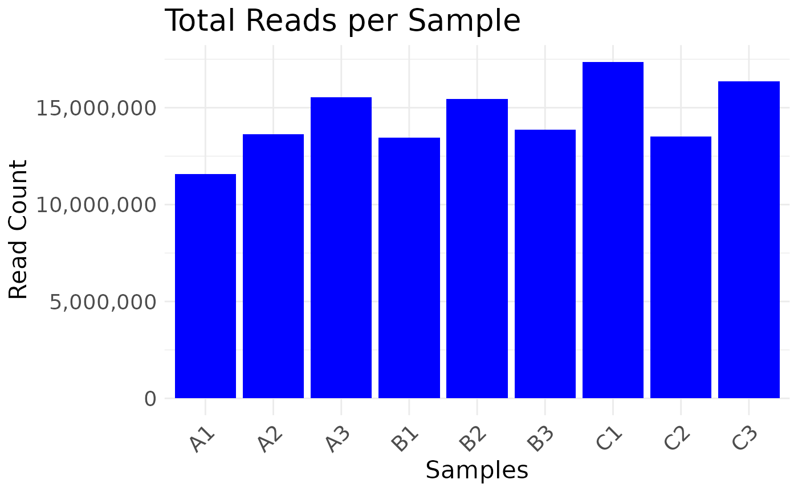

    #> Saving 7.29 x 4.51 in image
    #> * cleaning raw counts
    #> 
    #> Not able to identify multiple id's in GeneName
    #> 
    #> Columns that can be used to aggregate gene information GeneName
    #> 
    #> Aggregating the counts for the same ID in different chromosome locations.
    #> Column used to Aggregate duplicate IDs: GeneName
    #> Number of rows before Collapse: 43280
    #> 
    #> no duplicated IDs in GeneName
    #> 
    #> * filtering clean counts
    #> 
    #> Number of features after filtering: 7943
    #> 
    #> colors_for_plots NULL
    #> 
    #> colors_for_plots character

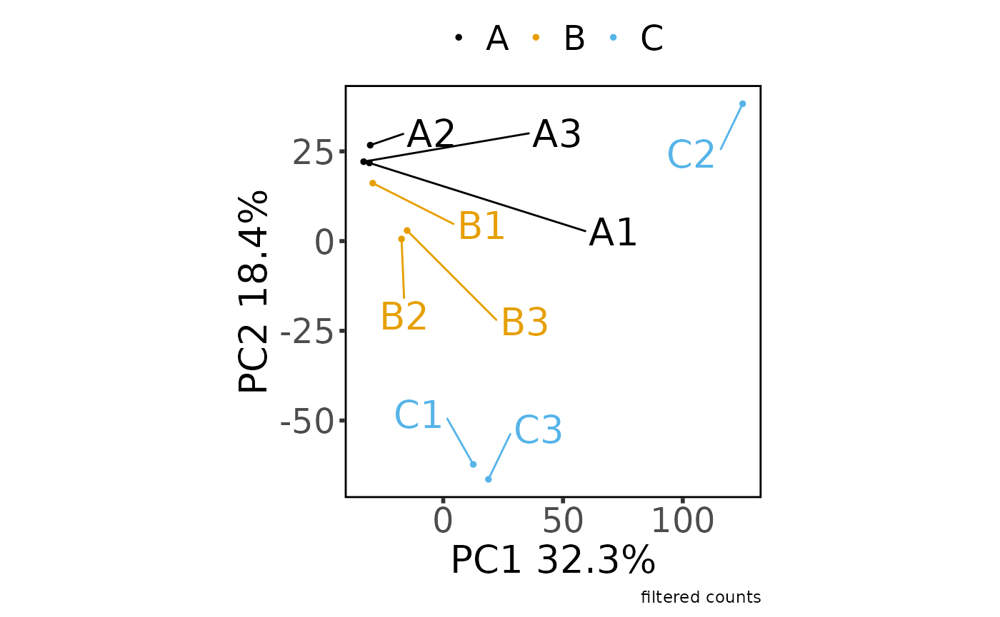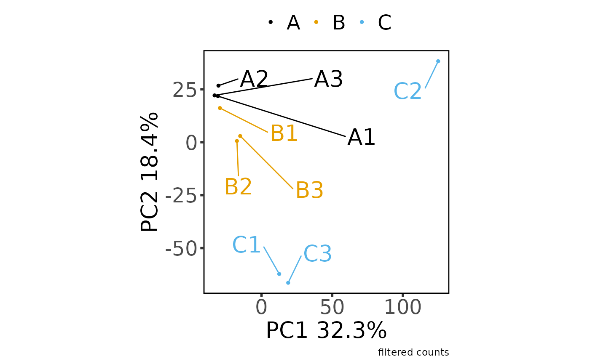

    #> Saving 7.29 x 4.51 in image

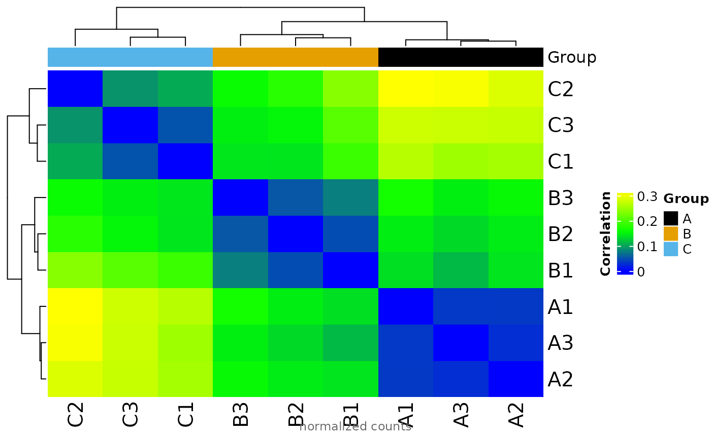

    #> Saving 7.29 x 4.51 in image
    #> * normalizing filt counts
    #> 
    #> Total number of features included: 7943

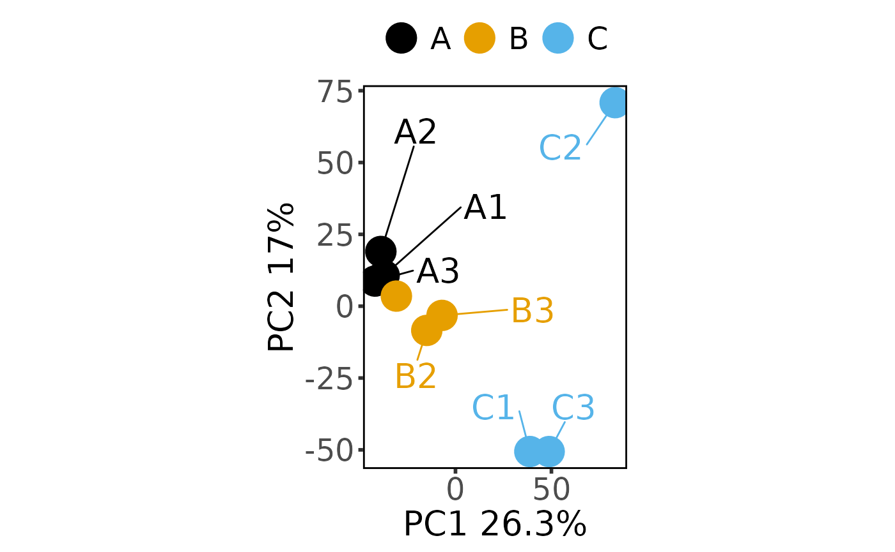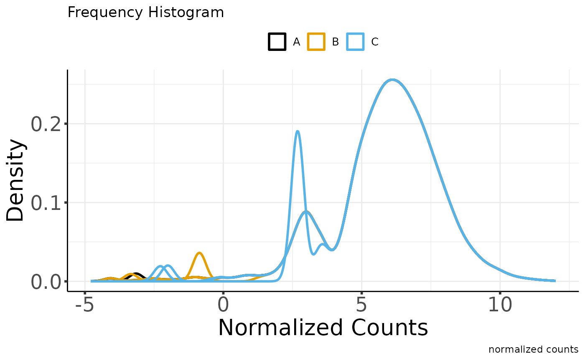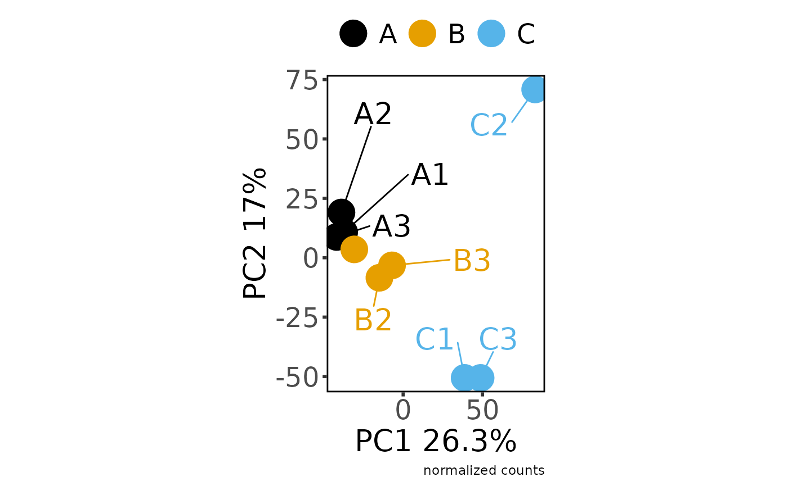

    #> Saving 7.29 x 4.51 in image

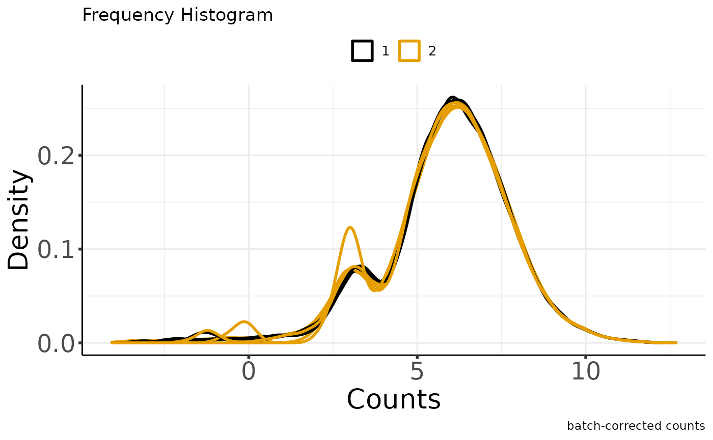

    #> Saving 7.29 x 4.51 in image
    #> Sample columns: A1, Sample columns: A2, Sample columns: A3, Sample columns: B1, Sample columns: B2, Sample columns: B3, Sample columns: C1, Sample columns: C2, Sample columns: C3
    #> 
    #> * batch-correcting norm-voom counts
    #> 
    #> Found2batches
    #> 
    #> Adjusting for2covariate(s) or covariate level(s)
    #> 
    #> Standardizing Data across genes
    #> 
    #> Fitting L/S model and finding priors
    #> 
    #> Finding parametric adjustments
    #> 
    #> Adjusting the Data

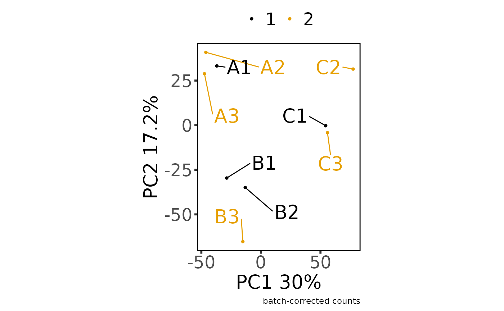

    #> Saving 7.29 x 4.51 in image

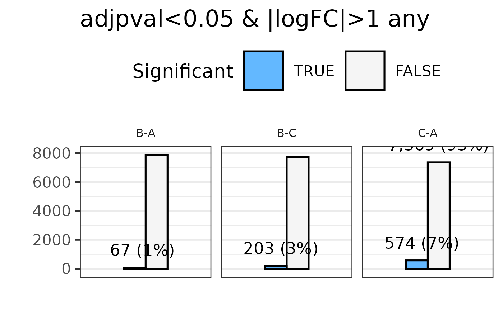

    #> Saving 7.29 x 4.51 in image

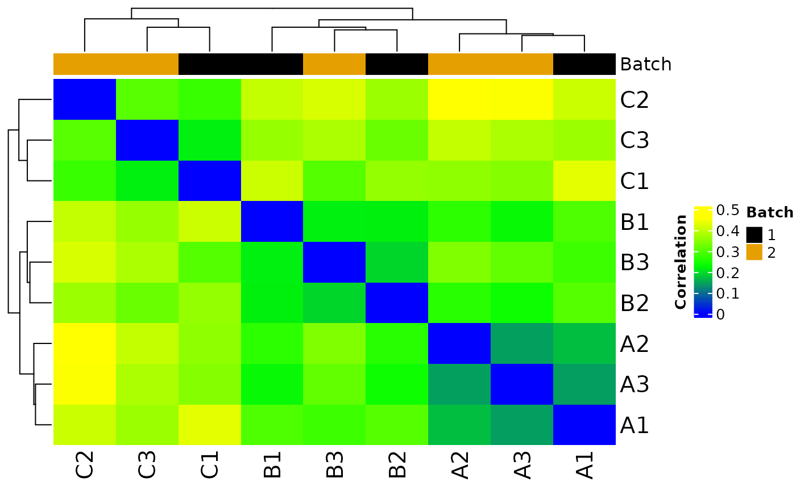

    #> The total number of features in output: 7943
    #> Number of samples after batch correction: 10
    #> * differential counts
    #> Setting first column of `counts` as gene annotation.
    #> Total number of genes included: 7943
    #> `geom_smooth()` using method = 'gam' and formula = 'y ~ s(x, bs = "cs")'

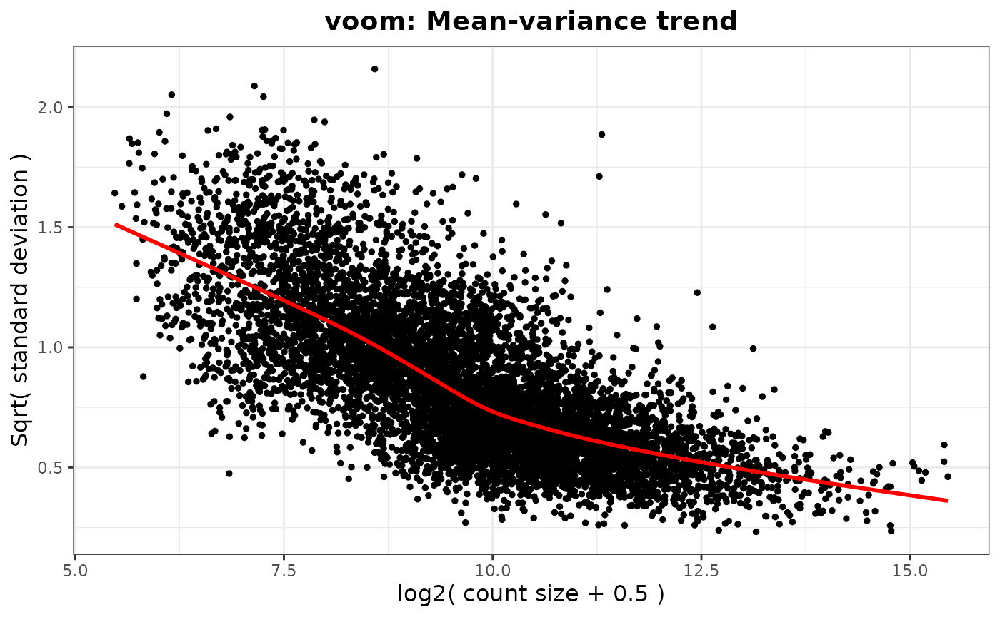

    #> Saving 7.29 x 4.51 in image
    #> `geom_smooth()` using method = 'gam' and formula = 'y ~ s(x, bs = "cs")'
    #> Joining with `by = join_by(GeneName)`
    #> Joining with `by = join_by(GeneName)`
    #> * filtering differential features
    #> 
    #> Total number of genes selected with adjpval < 0.05 and | logFC | ≥ 1 is sum(selgenes)

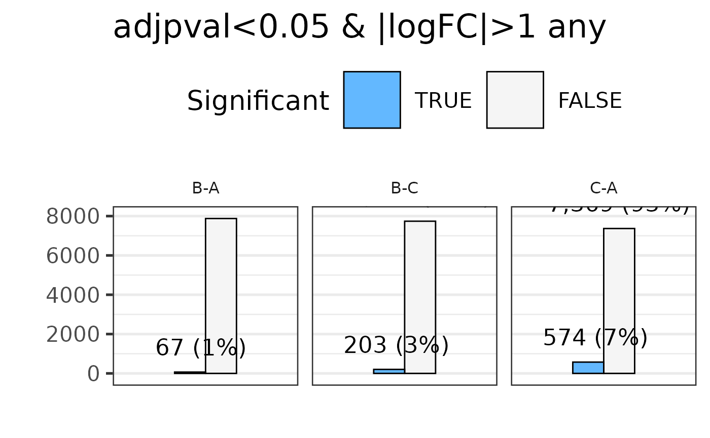

    #> Saving 7.29 x 4.51 in image

    moo_nidap@analyses$diff |>
      join_dfs_wide() |>
      head()
    #> Joining with `by = join_by(GeneName)`
    #> Joining with `by = join_by(GeneName)`
    #>   GeneName   B-A_FC  B-A_logFC B-A_tstat  B-A_pval B-A_adjpval    C-A_FC
    #> 1   Mrpl15 1.056918 0.07986336 0.2296406 0.8223259   0.9682828 -1.070209
    #> 2   Lypla1 1.365417 0.44934209 1.1181111 0.2858929   0.7838255 -1.071684
    #> 3    Tcea1 1.083512 0.11571458 0.3646249 0.7218792   0.9500829 -1.178162
    #> 4  Atp6v1h 1.312326 0.39212576 1.1284456 0.2816801   0.7806646 -1.221292
    #> 5   Rb1cc1 1.517238 0.60144765 1.3139591 0.2139732   0.7170238  1.312261
    #> 6   Pcmtd1 1.117922 0.16081942 0.2599816 0.7993845   0.9653317  3.252260
    #>     C-A_logFC  C-A_tstat    C-A_pval C-A_adjpval    B-C_FC  B-C_logFC
    #> 1 -0.09789257 -0.2970416 0.771628352  0.88942737  1.131123  0.1777559
    #> 2 -0.09987974 -0.2548947 0.803217764  0.90681218  1.463296  0.5492218
    #> 3 -0.23653758 -0.7638738 0.460029952  0.68969760  1.276552  0.3522522
    #> 4 -0.28840773 -0.8323447 0.421834968  0.65853678  1.602732  0.6805335
    #> 5  0.39205423  0.9026838 0.384853122  0.62798961  1.156202  0.2093934
    #> 6  1.70144270  3.4089997 0.005343376  0.05681718 -2.909202 -1.5406233
    #>    B-C_tstat   B-C_pval B-C_adjpval
    #> 1  0.5275092 0.60767222   0.8359440
    #> 2  1.3957137 0.18865496   0.4856181
    #> 3  1.1310868 0.28061102   0.5880985
    #> 4  1.9895488 0.07046708   0.3155517
    #> 5  0.4952214 0.62958893   0.8474567
    #> 6 -2.9434322 0.01255963   0.1421555

    moo_nidap@analyses$diff_filt |> head()
    #>   GeneName B-A_FC B-A_logFC B-A_tstat B-A_pval B-A_adjpval C-A_FC C-A_logFC
    #> 1     Rrs1  -2.06    -1.040    -2.860   0.0146       0.274  -2.71     -1.44
    #> 2     Mcm3  -1.45    -0.540    -1.850   0.0895       0.549  -2.46     -1.30
    #> 3   Ogfrl1   1.07     0.102     0.293   0.7750       0.960  -3.77     -1.92
    #> 4    Smap1   2.96     1.570     2.010   0.0686       0.500   5.68      2.51
    #> 5  Plekhb2  -1.24    -0.312    -1.100   0.2950       0.789   2.69      1.43
    #> 6   Il18r1   2.42     1.280     0.716   0.4880       0.873  36.60      5.19
    #>   C-A_tstat C-A_pval C-A_adjpval B-C_FC B-C_logFC B-C_tstat B-C_pval
    #> 1     -3.84 2.45e-03     0.03640   1.32     0.400     0.945 3.64e-01
    #> 2     -4.31 1.07e-03     0.02290   1.69     0.756     2.360 3.62e-02
    #> 3     -4.03 1.74e-03     0.03050   4.05     2.020     4.010 1.79e-03
    #> 4      3.59 3.81e-03     0.04690  -1.92    -0.938    -1.740 1.07e-01
    #> 5      5.98 7.03e-05     0.00461  -3.34    -1.740    -6.970 1.69e-05
    #> 6      3.16 8.41e-03     0.07450 -15.10    -3.920    -4.210 1.26e-03
    #>   B-C_adjpval
    #> 1     0.66400
    #> 2     0.23400
    #> 3     0.05570
    #> 4     0.38000
    #> 5     0.00334
    #> 6     0.04690

## The multiOmicDataSet object structure

``` r

str(moo_nidap)
#> <MOSuite::multiOmicDataSet>
#>  @ sample_meta:'data.frame': 9 obs. of  5 variables:
#>  .. $ Sample   : chr  "A1" "A2" "A3" "B1" ...
#>  .. $ Group    : chr  "A" "A" "A" "B" ...
#>  .. $ Replicate: num  1 2 3 1 2 3 1 2 3
#>  .. $ Batch    : num  1 2 2 1 1 2 1 2 2
#>  .. $ Label    : chr  "A1" "A2" "A3" "B1" ...
#>  .. - attr(*, "spec")=List of 3
#>  ..  ..$ cols   :List of 5
#>  ..  .. ..$ Sample   : list()
#>  ..  .. .. ..- attr(*, "class")= chr [1:2] "collector_character" "collector"
#>  ..  .. ..$ Group    : list()
#>  ..  .. .. ..- attr(*, "class")= chr [1:2] "collector_character" "collector"
#>  ..  .. ..$ Replicate: list()
#>  ..  .. .. ..- attr(*, "class")= chr [1:2] "collector_double" "collector"
#>  ..  .. ..$ Batch    : list()
#>  ..  .. .. ..- attr(*, "class")= chr [1:2] "collector_double" "collector"
#>  ..  .. ..$ Label    : list()
#>  ..  .. .. ..- attr(*, "class")= chr [1:2] "collector_character" "collector"
#>  ..  ..$ default: list()
#>  ..  .. ..- attr(*, "class")= chr [1:2] "collector_guess" "collector"
#>  ..  ..$ delim  : chr ","
#>  ..  ..- attr(*, "class")= chr "col_spec"
#>  .. - attr(*, "problems")=<externalptr> 
#>  @ annotation :'data.frame': 43280 obs. of  1 variable:
#>  .. $ GeneName: chr  "RP23-271O17.1" "Gm26206" "Xkr4" "RP23-317L18.1" ...
#>  .. - attr(*, "spec")=List of 3
#>  ..  ..$ cols   :List of 10
#>  ..  .. ..$ GeneName: list()
#>  ..  .. .. ..- attr(*, "class")= chr [1:2] "collector_character" "collector"
#>  ..  .. ..$ A1      : list()
#>  ..  .. .. ..- attr(*, "class")= chr [1:2] "collector_double" "collector"
#>  ..  .. ..$ A2      : list()
#>  ..  .. .. ..- attr(*, "class")= chr [1:2] "collector_double" "collector"
#>  ..  .. ..$ A3      : list()
#>  ..  .. .. ..- attr(*, "class")= chr [1:2] "collector_double" "collector"
#>  ..  .. ..$ B1      : list()
#>  ..  .. .. ..- attr(*, "class")= chr [1:2] "collector_double" "collector"
#>  ..  .. ..$ B2      : list()
#>  ..  .. .. ..- attr(*, "class")= chr [1:2] "collector_double" "collector"
#>  ..  .. ..$ B3      : list()
#>  ..  .. .. ..- attr(*, "class")= chr [1:2] "collector_double" "collector"
#>  ..  .. ..$ C1      : list()
#>  ..  .. .. ..- attr(*, "class")= chr [1:2] "collector_double" "collector"
#>  ..  .. ..$ C2      : list()
#>  ..  .. .. ..- attr(*, "class")= chr [1:2] "collector_double" "collector"
#>  ..  .. ..$ C3      : list()
#>  ..  .. .. ..- attr(*, "class")= chr [1:2] "collector_double" "collector"
#>  ..  ..$ default: list()
#>  ..  .. ..- attr(*, "class")= chr [1:2] "collector_guess" "collector"
#>  ..  ..$ delim  : chr ","
#>  ..  ..- attr(*, "class")= chr "col_spec"
#>  .. - attr(*, "problems")=<externalptr> 
#>  @ counts     :List of 5
#>  .. $ raw  :'data.frame':    43280 obs. of  10 variables:
#>  ..  ..$ GeneName: chr [1:43280] "RP23-271O17.1" "Gm26206" "Xkr4" "RP23-317L18.1" ...
#>  ..  ..$ A1      : num [1:43280] 0 0 0 0 0 0 0 0 0 0 ...
#>  ..  ..$ A2      : num [1:43280] 0 0 0 0 0 0 0 0 0 0 ...
#>  ..  ..$ A3      : num [1:43280] 0 0 0 0 0 0 0 0 0 0 ...
#>  ..  ..$ B1      : num [1:43280] 0 0 0 0 0 0 0 0 0 0 ...
#>  ..  ..$ B2      : num [1:43280] 0 0 0 0 0 0 0 0 0 1 ...
#>  ..  ..$ B3      : num [1:43280] 0 0 0 0 0 0 0 0 0 0 ...
#>  ..  ..$ C1      : num [1:43280] 0 0 0 0 0 0 0 0 0 0 ...
#>  ..  ..$ C2      : num [1:43280] 0 0 0 0 0 0 0 0 0 0 ...
#>  ..  ..$ C3      : num [1:43280] 0 0 0 0 0 0 0 0 0 0 ...
#>  ..  ..- attr(*, "spec")=List of 3
#>  ..  .. ..$ cols   :List of 10
#>  ..  .. .. ..$ GeneName: list()
#>  ..  .. .. .. ..- attr(*, "class")= chr [1:2] "collector_character" "collector"
#>  ..  .. .. ..$ A1      : list()
#>  ..  .. .. .. ..- attr(*, "class")= chr [1:2] "collector_double" "collector"
#>  ..  .. .. ..$ A2      : list()
#>  ..  .. .. .. ..- attr(*, "class")= chr [1:2] "collector_double" "collector"
#>  ..  .. .. ..$ A3      : list()
#>  ..  .. .. .. ..- attr(*, "class")= chr [1:2] "collector_double" "collector"
#>  ..  .. .. ..$ B1      : list()
#>  ..  .. .. .. ..- attr(*, "class")= chr [1:2] "collector_double" "collector"
#>  ..  .. .. ..$ B2      : list()
#>  ..  .. .. .. ..- attr(*, "class")= chr [1:2] "collector_double" "collector"
#>  ..  .. .. ..$ B3      : list()
#>  ..  .. .. .. ..- attr(*, "class")= chr [1:2] "collector_double" "collector"
#>  ..  .. .. ..$ C1      : list()
#>  ..  .. .. .. ..- attr(*, "class")= chr [1:2] "collector_double" "collector"
#>  ..  .. .. ..$ C2      : list()
#>  ..  .. .. .. ..- attr(*, "class")= chr [1:2] "collector_double" "collector"
#>  ..  .. .. ..$ C3      : list()
#>  ..  .. .. .. ..- attr(*, "class")= chr [1:2] "collector_double" "collector"
#>  ..  .. ..$ default: list()
#>  ..  .. .. ..- attr(*, "class")= chr [1:2] "collector_guess" "collector"
#>  ..  .. ..$ delim  : chr ","
#>  ..  .. ..- attr(*, "class")= chr "col_spec"
#>  ..  ..- attr(*, "problems")=<externalptr> 
#>  .. $ clean:'data.frame':    43280 obs. of  10 variables:
#>  ..  ..$ GeneName: chr [1:43280] "RP23-271O17.1" "Gm26206" "Xkr4" "RP23-317L18.1" ...
#>  ..  ..$ A1      : num [1:43280] 0 0 0 0 0 0 0 0 0 0 ...
#>  ..  ..$ A2      : num [1:43280] 0 0 0 0 0 0 0 0 0 0 ...
#>  ..  ..$ A3      : num [1:43280] 0 0 0 0 0 0 0 0 0 0 ...
#>  ..  ..$ B1      : num [1:43280] 0 0 0 0 0 0 0 0 0 0 ...
#>  ..  ..$ B2      : num [1:43280] 0 0 0 0 0 0 0 0 0 1 ...
#>  ..  ..$ B3      : num [1:43280] 0 0 0 0 0 0 0 0 0 0 ...
#>  ..  ..$ C1      : num [1:43280] 0 0 0 0 0 0 0 0 0 0 ...
#>  ..  ..$ C2      : num [1:43280] 0 0 0 0 0 0 0 0 0 0 ...
#>  ..  ..$ C3      : num [1:43280] 0 0 0 0 0 0 0 0 0 0 ...
#>  ..  ..- attr(*, "spec")=List of 3
#>  ..  .. ..$ cols   :List of 10
#>  ..  .. .. ..$ GeneName: list()
#>  ..  .. .. .. ..- attr(*, "class")= chr [1:2] "collector_character" "collector"
#>  ..  .. .. ..$ A1      : list()
#>  ..  .. .. .. ..- attr(*, "class")= chr [1:2] "collector_double" "collector"
#>  ..  .. .. ..$ A2      : list()
#>  ..  .. .. .. ..- attr(*, "class")= chr [1:2] "collector_double" "collector"
#>  ..  .. .. ..$ A3      : list()
#>  ..  .. .. .. ..- attr(*, "class")= chr [1:2] "collector_double" "collector"
#>  ..  .. .. ..$ B1      : list()
#>  ..  .. .. .. ..- attr(*, "class")= chr [1:2] "collector_double" "collector"
#>  ..  .. .. ..$ B2      : list()
#>  ..  .. .. .. ..- attr(*, "class")= chr [1:2] "collector_double" "collector"
#>  ..  .. .. ..$ B3      : list()
#>  ..  .. .. .. ..- attr(*, "class")= chr [1:2] "collector_double" "collector"
#>  ..  .. .. ..$ C1      : list()
#>  ..  .. .. .. ..- attr(*, "class")= chr [1:2] "collector_double" "collector"
#>  ..  .. .. ..$ C2      : list()
#>  ..  .. .. .. ..- attr(*, "class")= chr [1:2] "collector_double" "collector"
#>  ..  .. .. ..$ C3      : list()
#>  ..  .. .. .. ..- attr(*, "class")= chr [1:2] "collector_double" "collector"
#>  ..  .. ..$ default: list()
#>  ..  .. .. ..- attr(*, "class")= chr [1:2] "collector_guess" "collector"
#>  ..  .. ..$ delim  : chr ","
#>  ..  .. ..- attr(*, "class")= chr "col_spec"
#>  ..  ..- attr(*, "problems")=<externalptr> 
#>  .. $ filt :'data.frame':    7943 obs. of  10 variables:
#>  ..  ..$ GeneName: chr [1:7943] "Mrpl15" "Lypla1" "Tcea1" "Atp6v1h" ...
#>  ..  ..$ A1      : num [1:7943] 1245 1483 1381 1033 666 ...
#>  ..  ..$ A2      : num [1:7943] 1341 1410 2044 1959 1397 ...
#>  ..  ..$ A3      : num [1:7943] 1476 1370 2051 1890 1576 ...
#>  ..  ..$ B1      : num [1:7943] 965 1146 2325 2075 681 ...
#>  ..  ..$ B2      : num [1:7943] 1235 1422 2386 2702 2040 ...
#>  ..  ..$ B3      : num [1:7943] 1784 2624 1893 2150 1988 ...
#>  ..  ..$ C1      : num [1:7943] 1058 991 2391 2436 774 ...
#>  ..  ..$ C2      : num [1:7943] 1732 1101 916 1321 1921 ...
#>  ..  ..$ C3      : num [1:7943] 1531 2352 2261 1018 2660 ...
#>  ..  ..- attr(*, "spec")=List of 3
#>  ..  .. ..$ cols   :List of 10
#>  ..  .. .. ..$ GeneName: list()
#>  ..  .. .. .. ..- attr(*, "class")= chr [1:2] "collector_character" "collector"
#>  ..  .. .. ..$ A1      : list()
#>  ..  .. .. .. ..- attr(*, "class")= chr [1:2] "collector_double" "collector"
#>  ..  .. .. ..$ A2      : list()
#>  ..  .. .. .. ..- attr(*, "class")= chr [1:2] "collector_double" "collector"
#>  ..  .. .. ..$ A3      : list()
#>  ..  .. .. .. ..- attr(*, "class")= chr [1:2] "collector_double" "collector"
#>  ..  .. .. ..$ B1      : list()
#>  ..  .. .. .. ..- attr(*, "class")= chr [1:2] "collector_double" "collector"
#>  ..  .. .. ..$ B2      : list()
#>  ..  .. .. .. ..- attr(*, "class")= chr [1:2] "collector_double" "collector"
#>  ..  .. .. ..$ B3      : list()
#>  ..  .. .. .. ..- attr(*, "class")= chr [1:2] "collector_double" "collector"
#>  ..  .. .. ..$ C1      : list()
#>  ..  .. .. .. ..- attr(*, "class")= chr [1:2] "collector_double" "collector"
#>  ..  .. .. ..$ C2      : list()
#>  ..  .. .. .. ..- attr(*, "class")= chr [1:2] "collector_double" "collector"
#>  ..  .. .. ..$ C3      : list()
#>  ..  .. .. .. ..- attr(*, "class")= chr [1:2] "collector_double" "collector"
#>  ..  .. ..$ default: list()
#>  ..  .. .. ..- attr(*, "class")= chr [1:2] "collector_guess" "collector"
#>  ..  .. ..$ delim  : chr ","
#>  ..  .. ..- attr(*, "class")= chr "col_spec"
#>  ..  ..- attr(*, "problems")=<externalptr> 
#>  .. $ norm :List of 1
#>  ..  ..$ voom:'data.frame':  7943 obs. of  10 variables:
#>  ..  .. ..$ GeneName: chr [1:7943] "Mrpl15" "Lypla1" "Tcea1" "Atp6v1h" ...
#>  ..  .. ..$ A1      : num [1:7943] 6.79 7.04 6.93 6.51 5.85 ...
#>  ..  .. ..$ A2      : num [1:7943] 6.7 6.78 7.32 7.26 6.76 ...
#>  ..  .. ..$ A3      : num [1:7943] 6.64 6.53 7.13 7 6.75 ...
#>  ..  .. ..$ B1      : num [1:7943] 6.22 6.47 7.48 7.31 5.75 ...
#>  ..  .. ..$ B2      : num [1:7943] 6.38 6.57 7.33 7.52 7.11 ...
#>  ..  .. ..$ B3      : num [1:7943] 7.02 7.59 7.11 7.3 7.17 ...
#>  ..  .. ..$ C1      : num [1:7943] 6.02 5.92 7.19 7.22 5.56 ...
#>  ..  .. ..$ C2      : num [1:7943] 7.03 6.43 6.19 6.67 7.19 ...
#>  ..  .. ..$ C3      : num [1:7943] 6.6 7.25 7.2 6.01 7.43 ...
#>  .. $ batch:'data.frame':    7943 obs. of  10 variables:
#>  ..  ..$ GeneName: chr [1:7943] "Mrpl15" "Lypla1" "Tcea1" "Atp6v1h" ...
#>  ..  ..$ A1      : num [1:7943] 6.92 7.2 6.87 6.51 6.23 ...
#>  ..  ..$ A2      : num [1:7943] 6.59 6.66 7.33 7.25 6.46 ...
#>  ..  ..$ A3      : num [1:7943] 6.54 6.43 7.16 7.02 6.45 ...
#>  ..  ..$ B1      : num [1:7943] 6.41 6.68 7.42 7.28 6.27 ...
#>  ..  ..$ B2      : num [1:7943] 6.55 6.78 7.27 7.47 7.35 ...
#>  ..  ..$ B3      : num [1:7943] 6.88 7.4 7.16 7.33 6.89 ...
#>  ..  ..$ C1      : num [1:7943] 6.21 6.13 7.13 7.13 6.06 ...
#>  ..  ..$ C2      : num [1:7943] 6.87 6.32 6.32 6.69 6.88 ...
#>  ..  ..$ C3      : num [1:7943] 6.48 7.04 7.18 6.1 7.1 ...
#>  @ analyses   :List of 3
#>  .. $ colors   :List of 5
#>  ..  ..$ Sample   : Named chr [1:9] "#000000" "#E69F00" "#56B4E9" "#009E73" ...
#>  ..  .. ..- attr(*, "names")= chr [1:9] "A1" "A2" "A3" "B1" ...
#>  ..  ..$ Group    : Named chr [1:3] "#000000" "#E69F00" "#56B4E9"
#>  ..  .. ..- attr(*, "names")= chr [1:3] "A" "B" "C"
#>  ..  ..$ Replicate: Named chr [1:3] "#000000" "#E69F00" "#56B4E9"
#>  ..  .. ..- attr(*, "names")= chr [1:3] "1" "2" "3"
#>  ..  ..$ Batch    : Named chr [1:2] "#000000" "#E69F00"
#>  ..  .. ..- attr(*, "names")= chr [1:2] "1" "2"
#>  ..  ..$ Label    : Named chr [1:9] "#000000" "#E69F00" "#56B4E9" "#009E73" ...
#>  ..  .. ..- attr(*, "names")= chr [1:9] "A1" "A2" "A3" "B1" ...
#>  .. $ diff     :List of 3
#>  ..  ..$ B-A:'data.frame':   7943 obs. of  6 variables:
#>  ..  .. ..$ GeneName: chr [1:7943] "Mrpl15" "Lypla1" "Tcea1" "Atp6v1h" ...
#>  ..  .. ..$ FC      : num [1:7943] 1.06 1.37 1.08 1.31 1.52 ...
#>  ..  .. ..$ logFC   : num [1:7943] 0.0799 0.4493 0.1157 0.3921 0.6014 ...
#>  ..  .. ..$ tstat   : num [1:7943] 0.23 1.118 0.365 1.128 1.314 ...
#>  ..  .. ..$ pval    : num [1:7943] 0.822 0.286 0.722 0.282 0.214 ...
#>  ..  .. ..$ adjpval : num [1:7943] 0.968 0.784 0.95 0.781 0.717 ...
#>  ..  ..$ C-A:'data.frame':   7943 obs. of  6 variables:
#>  ..  .. ..$ GeneName: chr [1:7943] "Mrpl15" "Lypla1" "Tcea1" "Atp6v1h" ...
#>  ..  .. ..$ FC      : num [1:7943] -1.07 -1.07 -1.18 -1.22 1.31 ...
#>  ..  .. ..$ logFC   : num [1:7943] -0.0979 -0.0999 -0.2365 -0.2884 0.3921 ...
#>  ..  .. ..$ tstat   : num [1:7943] -0.297 -0.255 -0.764 -0.832 0.903 ...
#>  ..  .. ..$ pval    : num [1:7943] 0.772 0.803 0.46 0.422 0.385 ...
#>  ..  .. ..$ adjpval : num [1:7943] 0.889 0.907 0.69 0.659 0.628 ...
#>  ..  ..$ B-C:'data.frame':   7943 obs. of  6 variables:
#>  ..  .. ..$ GeneName: chr [1:7943] "Mrpl15" "Lypla1" "Tcea1" "Atp6v1h" ...
#>  ..  .. ..$ FC      : num [1:7943] 1.13 1.46 1.28 1.6 1.16 ...
#>  ..  .. ..$ logFC   : num [1:7943] 0.178 0.549 0.352 0.681 0.209 ...
#>  ..  .. ..$ tstat   : num [1:7943] 0.528 1.396 1.131 1.99 0.495 ...
#>  ..  .. ..$ pval    : num [1:7943] 0.6077 0.1887 0.2806 0.0705 0.6296 ...
#>  ..  .. ..$ adjpval : num [1:7943] 0.836 0.486 0.588 0.316 0.847 ...
#>  .. $ diff_filt:'data.frame':    641 obs. of  16 variables:
#>  ..  ..$ GeneName   : chr [1:641] "Rrs1" "Mcm3" "Ogfrl1" "Smap1" ...
#>  ..  ..$ B-A_FC     : num [1:641] -2.06 -1.45 1.07 2.96 -1.24 2.42 -1.63 2.4 53.3 1.63 ...
#>  ..  ..$ B-A_logFC  : num [1:641] -1.04 -0.54 0.102 1.57 -0.312 1.28 -0.708 1.26 5.74 0.709 ...
#>  ..  ..$ B-A_tstat  : num [1:641] -2.86 -1.85 0.293 2.01 -1.1 0.716 -1.9 3.2 3.65 1.93 ...
#>  ..  ..$ B-A_pval   : num [1:641] 0.0146 0.0895 0.775 0.0686 0.295 0.488 0.0821 0.0079 0.00344 0.0786 ...
#>  ..  ..$ B-A_adjpval: num [1:641] 0.274 0.549 0.96 0.5 0.789 0.873 0.532 0.211 0.139 0.525 ...
#>  ..  ..$ C-A_FC     : num [1:641] -2.71 -2.46 -3.77 5.68 2.69 36.6 3.13 2.74 287 -6.41 ...
#>  ..  ..$ C-A_logFC  : num [1:641] -1.44 -1.3 -1.92 2.51 1.43 5.19 1.65 1.45 8.16 -2.68 ...
#>  ..  ..$ C-A_tstat  : num [1:641] -3.84 -4.31 -4.03 3.59 5.98 3.16 5.61 3.97 5.45 -3.83 ...
#>  ..  ..$ C-A_pval   : num [1:641] 2.45e-03 1.07e-03 1.74e-03 3.81e-03 7.03e-05 8.41e-03 1.25e-04 1.95e-03 1.60e-04 2.50e-03 ...
#>  ..  ..$ C-A_adjpval: num [1:641] 0.0364 0.0229 0.0305 0.0469 0.00461 0.0745 0.00655 0.0321 0.00759 0.0368 ...
#>  ..  ..$ B-C_FC     : num [1:641] 1.32 1.69 4.05 -1.92 -3.34 -15.1 -5.11 -1.14 -5.38 10.5 ...
#>  ..  ..$ B-C_logFC  : num [1:641] 0.4 0.756 2.02 -0.938 -1.74 -3.92 -2.35 -0.19 -2.43 3.39 ...
#>  ..  ..$ B-C_tstat  : num [1:641] 0.945 2.36 4.01 -1.74 -6.97 -4.21 -7.09 -0.585 -4 4.57 ...
#>  ..  ..$ B-C_pval   : num [1:641] 3.64e-01 3.62e-02 1.79e-03 1.07e-01 1.69e-05 1.26e-03 1.43e-05 5.69e-01 1.84e-03 6.86e-04 ...
#>  ..  ..$ B-C_adjpval: num [1:641] 0.664 0.234 0.0557 0.38 0.00334 0.0469 0.00307 0.815 0.0562 0.0334 ...
```
