# Visualization with built-in plots

``` r

library(MOSuite)
#> Warning: replacing previous import 'S4Arrays::makeNindexFromArrayViewport' by
#> 'DelayedArray::makeNindexFromArrayViewport' when loading 'SummarizedExperiment'
```

## Default plots from each step

Default plots can be printed to the screen and/or saved to the disk.

``` r

# set options to print & save the plots
options(moo_print_plots = TRUE)
options(moo_save_plots = TRUE)
# when moo_save_plots is TRUE, plots are saved to this directory:
options(moo_plots_dir = "./figures")
```

See
[`?MOSuite::options`](https://ccbr.github.io/MOSuite/reference/options.md)
for more information.

### clean

``` r

moo <- create_multiOmicDataSet_from_dataframes(
  sample_metadata = as.data.frame(nidap_sample_metadata),
  counts_dat = as.data.frame(nidap_raw_counts)
) |>
  clean_raw_counts()
```

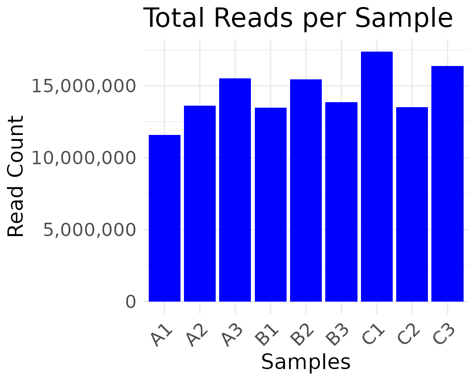

    #> Saving 5 x 4 in image
    #> * cleaning raw counts
    #> 
    #> Not able to identify multiple id's in GeneName
    #> 
    #> Columns that can be used to aggregate gene information GeneName
    #> 
    #> Aggregating the counts for the same ID in different chromosome locations.
    #> Column used to Aggregate duplicate IDs: GeneName
    #> Number of rows before Collapse: 43280
    #> 
    #> no duplicated IDs in GeneName

### filter

``` r

moo <- moo |>
  filter_counts(group_colname = "Group")
#> * filtering clean counts
#> Number of features after filtering: 7943
#> colors_for_plots NULL
#> colors_for_plots character
```

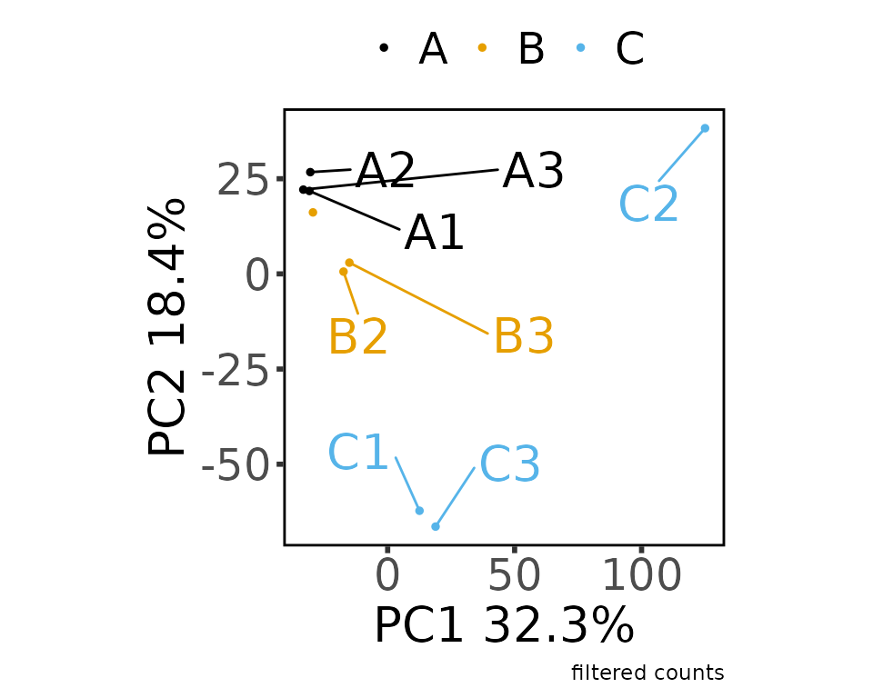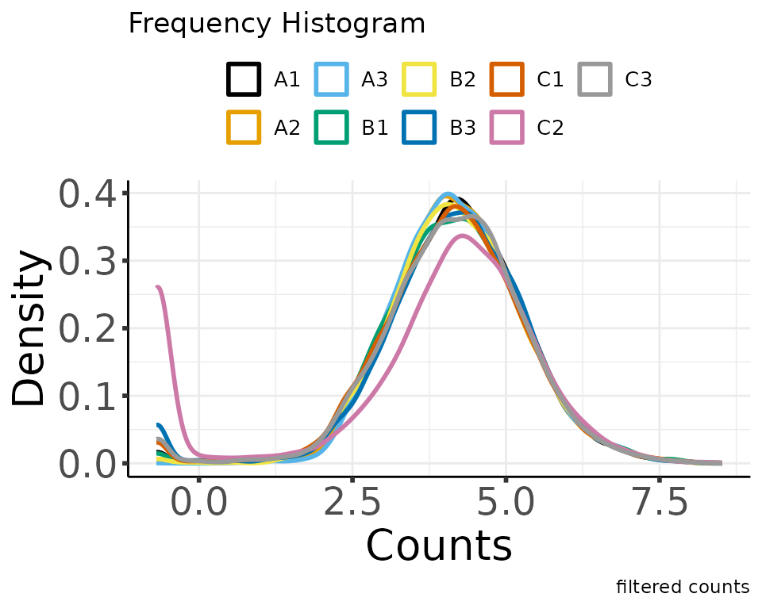

    #> Saving 5 x 4 in image

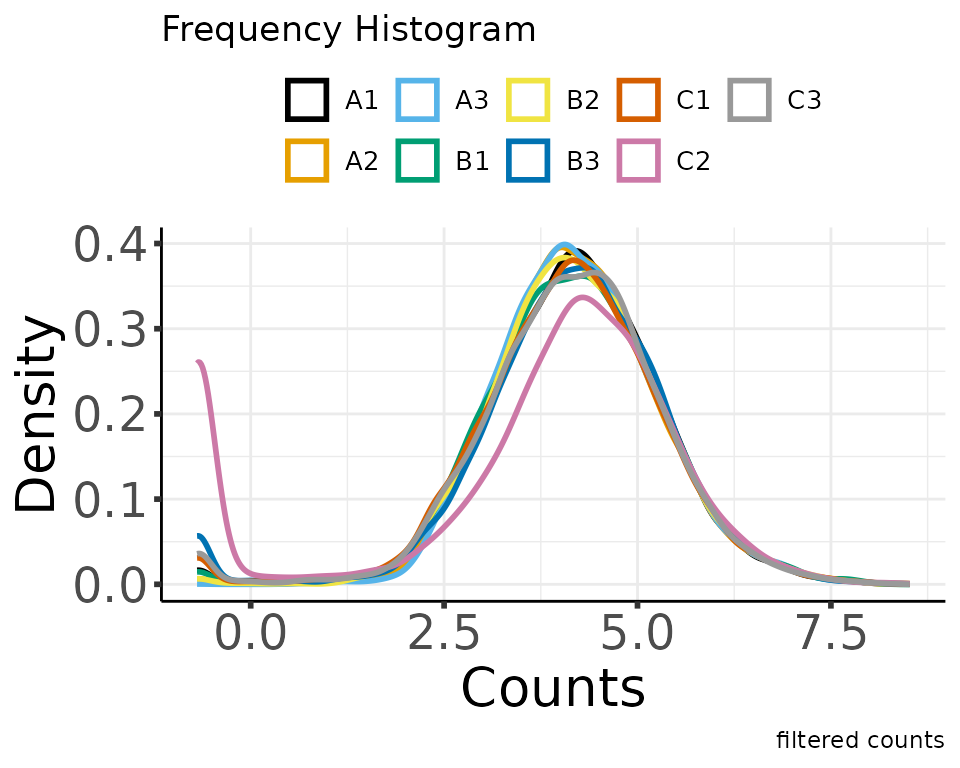

    #> Saving 5 x 4 in image

### normalize

``` r

moo <- moo |>
  normalize_counts(group_colname = "Group")
#> * normalizing filt counts
#> Total number of features included: 7943
```

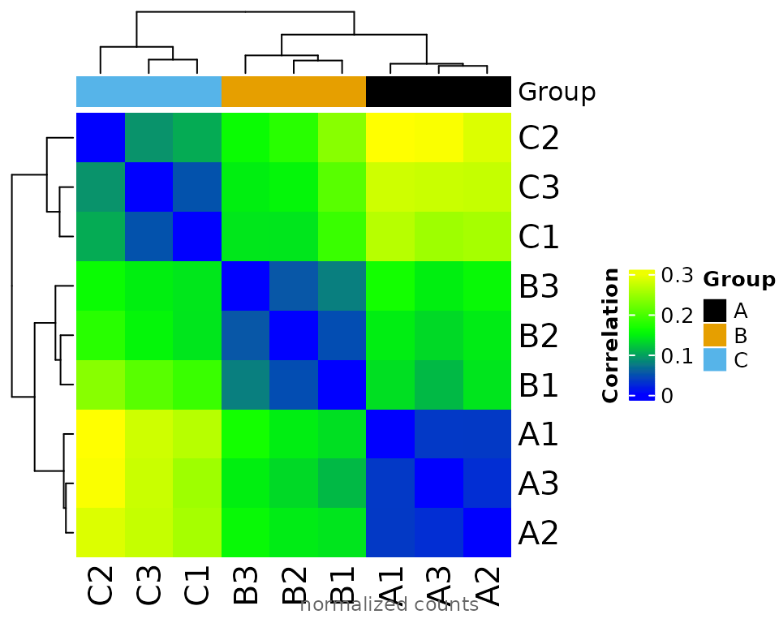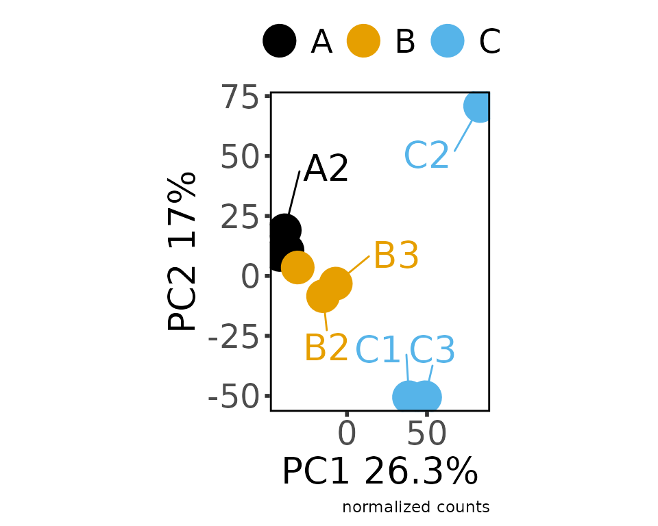

    #> Saving 5 x 4 in image

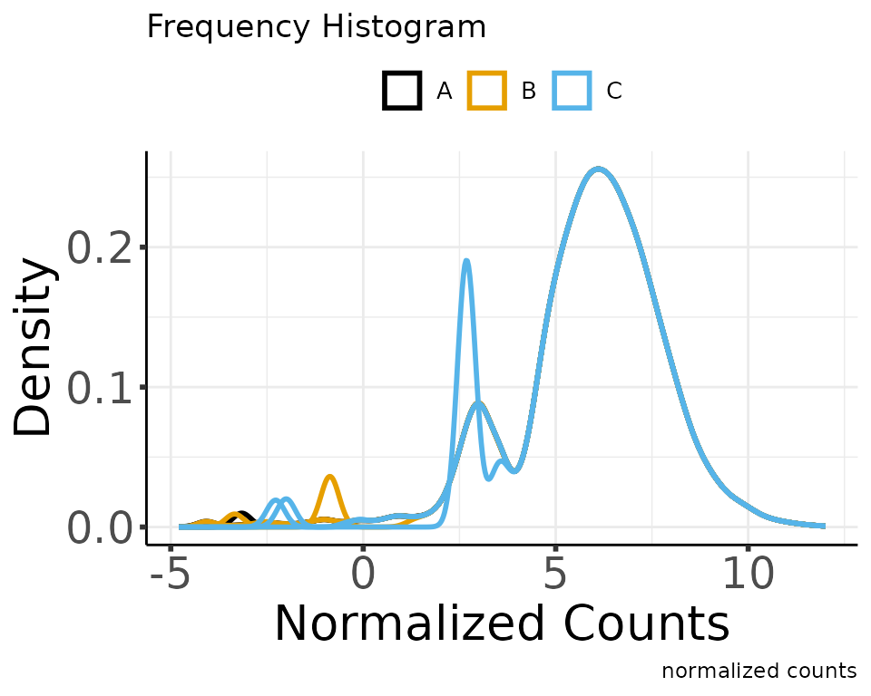

    #> Saving 5 x 4 in image
    #> Sample columns: A1, Sample columns: A2, Sample columns: A3, Sample columns: B1, Sample columns: B2, Sample columns: B3, Sample columns: C1, Sample columns: C2, Sample columns: C3

### batch correct

``` r

moo <- moo |>
  batch_correct_counts(
    covariates_colname = "Group",
    batch_colname = "Batch",
    label_colname = "Label"
  )
#> * batch-correcting norm-voom counts
#> Found2batches
#> Adjusting for2covariate(s) or covariate level(s)
#> Standardizing Data across genes
#> Fitting L/S model and finding priors
#> Finding parametric adjustments
#> Adjusting the Data
```

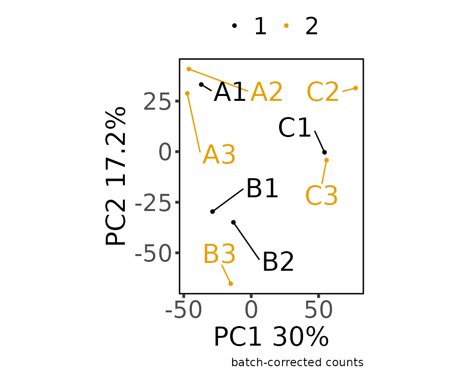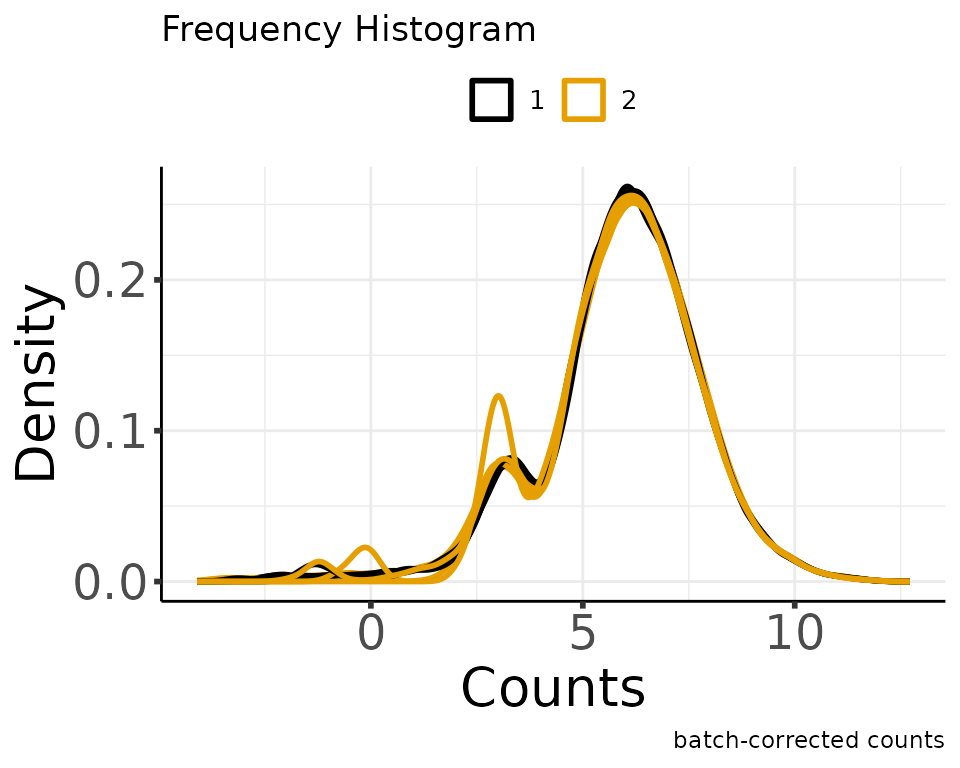

    #> Saving 5 x 4 in image

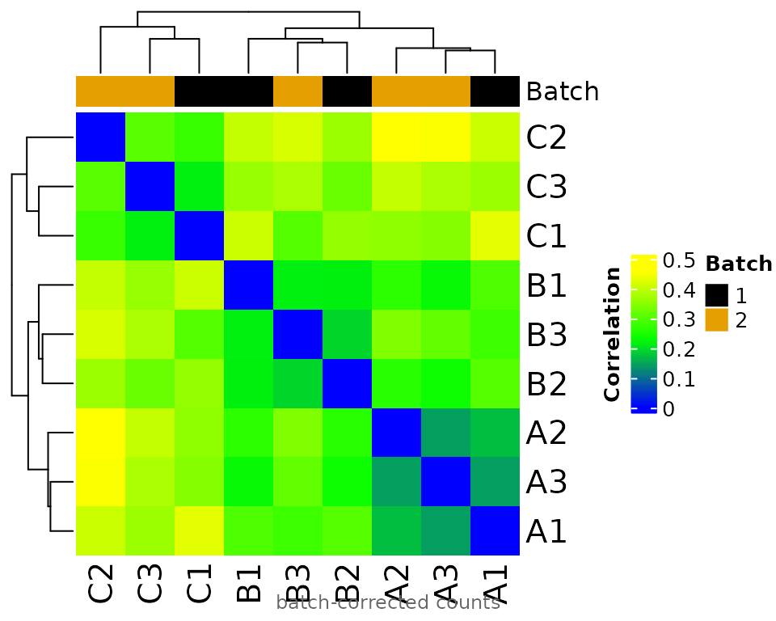

    #> Saving 5 x 4 in image


    #> The total number of features in output: 7943
    #> Number of samples after batch correction: 10

### differential expression

``` r

moo <- moo |>
  diff_counts(
    count_type = "filt",
    covariates_colnames = c("Group", "Batch"),
    contrast_colname = c("Group"),
    contrasts = c("B-A", "C-A", "B-C"),
    input_in_log_counts = FALSE,
    return_mean_and_sd = FALSE,
    voom_normalization_method = "quantile",
  )
#> * differential counts
#> Setting first column of `counts` as gene annotation.
#> Total number of genes included: 7943
#> `geom_smooth()` using method = 'gam' and formula = 'y ~ s(x, bs = "cs")'
```

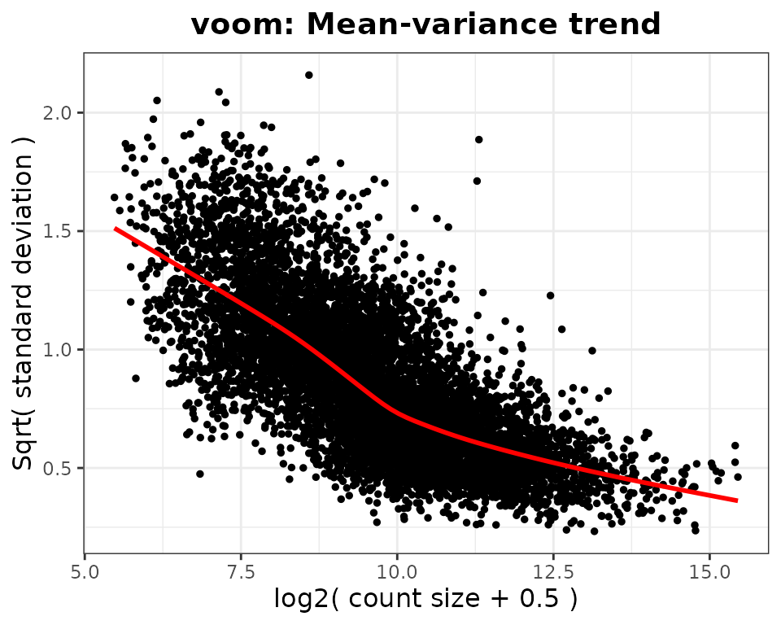

    #> Saving 5 x 4 in image
    #> `geom_smooth()` using method = 'gam' and formula = 'y ~ s(x, bs = "cs")'

### filter differential features

``` r

moo <- moo |> filter_diff()
#> Joining with `by = join_by(GeneName)`
#> Joining with `by = join_by(GeneName)`
#> * filtering differential features
#> Total number of genes selected with adjpval < 0.05 and | logFC | ≥ 1 is
#> sum(selgenes)
```

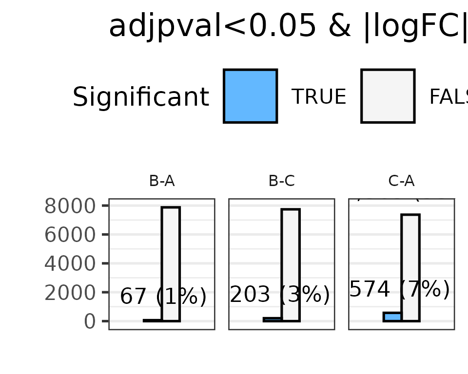

    #> Saving 5 x 4 in image

## Customize plots

TODO

- show how to use individual plotting functions
- how to customize & override default color palettes
- how to customize ggplot objects

### 3D PCA

``` r

plot_pca(
  moo@counts$batch,
  moo@sample_meta,
  principal_components = c(1, 2, 3),
  group_colname = "Group",
  label_colname = "Label",
  color_values = moo@analyses[["colors"]][["Group"]]
)
```

### Expression Heatmap

``` r

heatmap_plot <- plot_expr_heatmap(
  moo,
  count_type = "norm",
  sub_count_type = "voom"
)
#> The total number of genes in heatmap: 500
```


``` r

print(heatmap_plot)
```

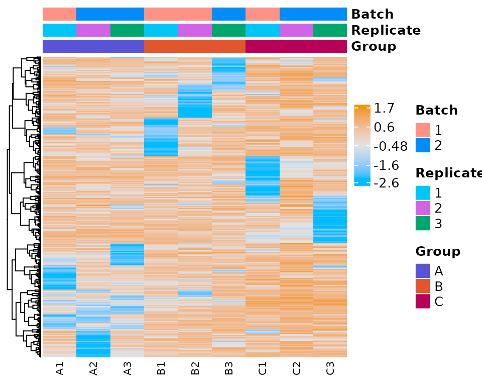

### Volcano

#### Summary

``` r

dat_volcano_summary <- moo@analyses$diff |>
  join_dfs_wide() |>
  plot_volcano_summary()
#> Joining with `by = join_by(GeneName)`
#> Joining with `by = join_by(GeneName)`
#> Preparing table for contrast: B-A
#> Fold change column: B-A_logFC
#> pval column: B-A_pval
#> Total number of features included in volcano plot: 7943
#> Preparing table for contrast: C-A
#> Fold change column: C-A_logFC
#> pval column: C-A_pval
#> Total number of features included in volcano plot: 7943
#> Preparing table for contrast: B-C
#> Fold change column: B-C_logFC
#> pval column: B-C_pval
#> Total number of features included in volcano plot: 7943
```

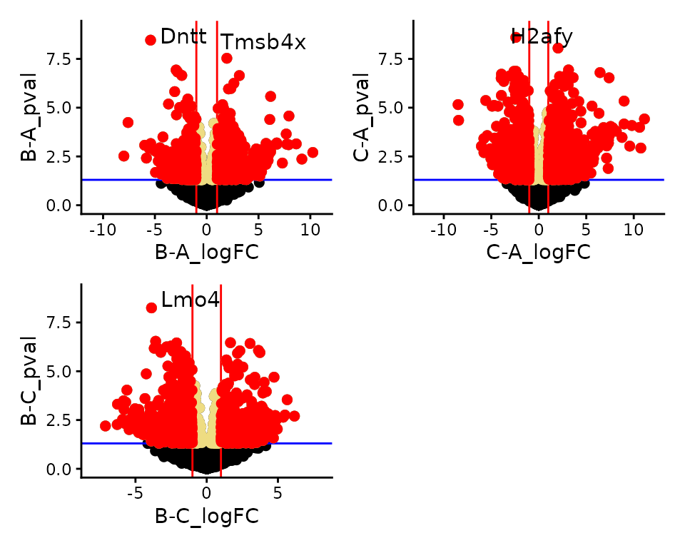

    #> Saving 5 x 4 in image

    head(dat_volcano_summary)
    #>       GeneName Contrast         FC     logFC     tstat         pval
    #> B-A.1     Dntt      B-A -42.727551 -5.417095 -15.54572 3.460410e-09
    #> B-A.2   Tmsb4x      B-A   3.845863  1.943307  12.82926 2.930649e-08
    #> B-A.3     Flt3      B-A  -7.743692 -2.953022 -11.29797 1.173487e-07
    #> B-A.4  Tspan13      B-A  -7.035795 -2.814713 -11.06018 1.476477e-07
    #> B-A.5    Tapt1      B-A  -5.297586 -2.405335 -10.64544 2.226279e-07
    #> B-A.6    Itgb7      B-A   8.882141  3.150907  10.62882 2.263833e-07
    #>            adjpval
    #> B-A.1 2.748604e-05
    #> B-A.2 1.163907e-04
    #> B-A.3 2.931915e-04
    #> B-A.4 2.931915e-04
    #> B-A.5 2.996937e-04
    #> B-A.6 2.996937e-04

#### Enhanced

``` r

dat_volcano_enhanced <- moo@analyses$diff |>
  join_dfs_wide() |>
  plot_volcano_enhanced()
#> Joining with `by = join_by(GeneName)`
#> Joining with `by = join_by(GeneName)`
#> Genes in initial dataset: 7943
#> Max y: 4.56088783571366
#> Genes in initial dataset: 7943
#> Max y: 4.34744066227959
```

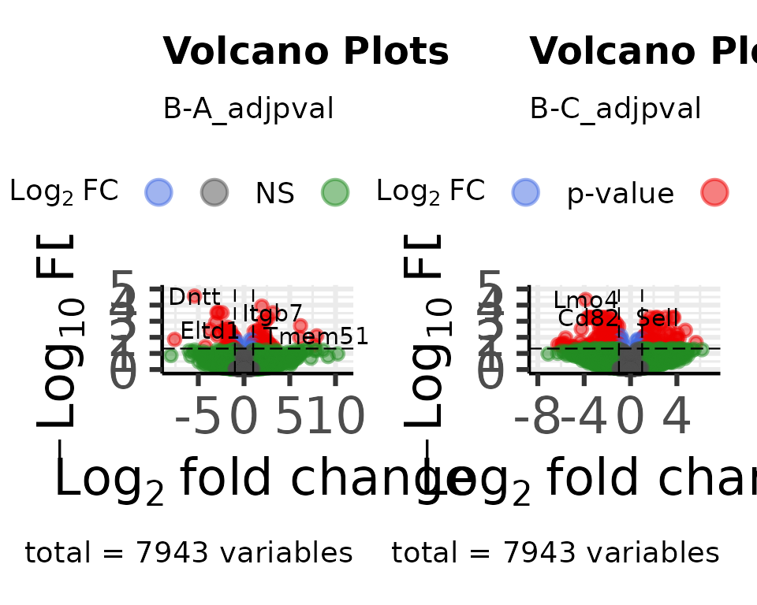

### Venn Diagram

``` r

venn_dat <- dat_volcano_summary |> plot_venn_diagram()
#> All intersections: 1:7,c(1, 2, 3, 4, 5, 6, 7),c(80, 119, 264, 493, 152, 270, 516),c("Yes", "Yes", "Yes", "Yes", "Yes", "Yes", "Yes")
#> Intersections returned: 1:7,c(1, 2, 3, 4, 5, 6, 7),c(80, 119, 264, 493, 152, 270, 516)
```

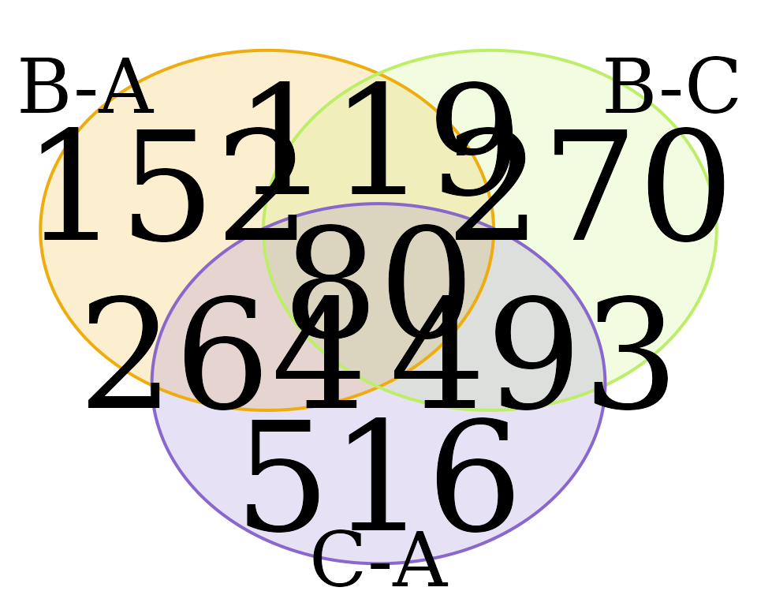

``` r

head(venn_dat)
#>    Gene      Intersection Id Size
#> 1  Dntt (B-A ∩ B-C ∩ C-A)  1   80
#> 2  Flt3 (B-A ∩ B-C ∩ C-A)  1   80
#> 3   Id2 (B-A ∩ B-C ∩ C-A)  1   80
#> 4 Eltd1 (B-A ∩ B-C ∩ C-A)  1   80
#> 5 Runx3 (B-A ∩ B-C ∩ C-A)  1   80
#> 6 Dusp6 (B-A ∩ B-C ∩ C-A)  1   80
```
