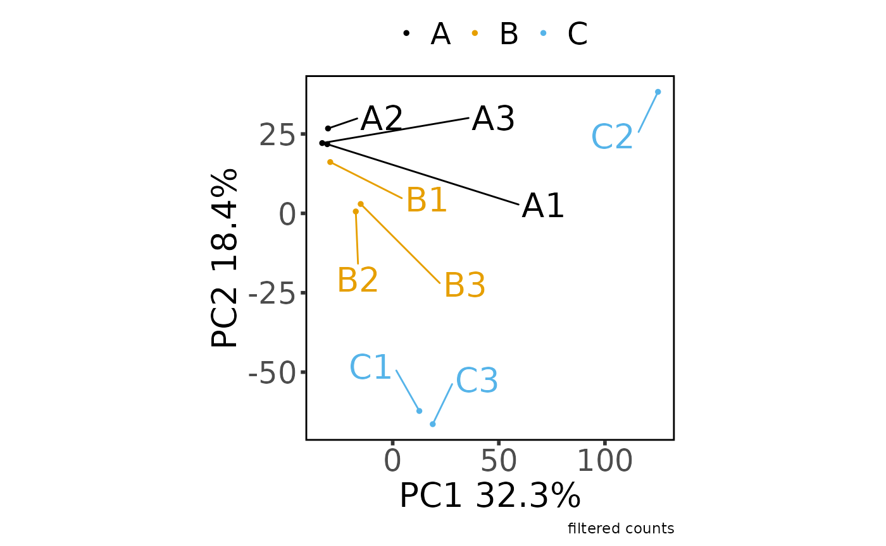
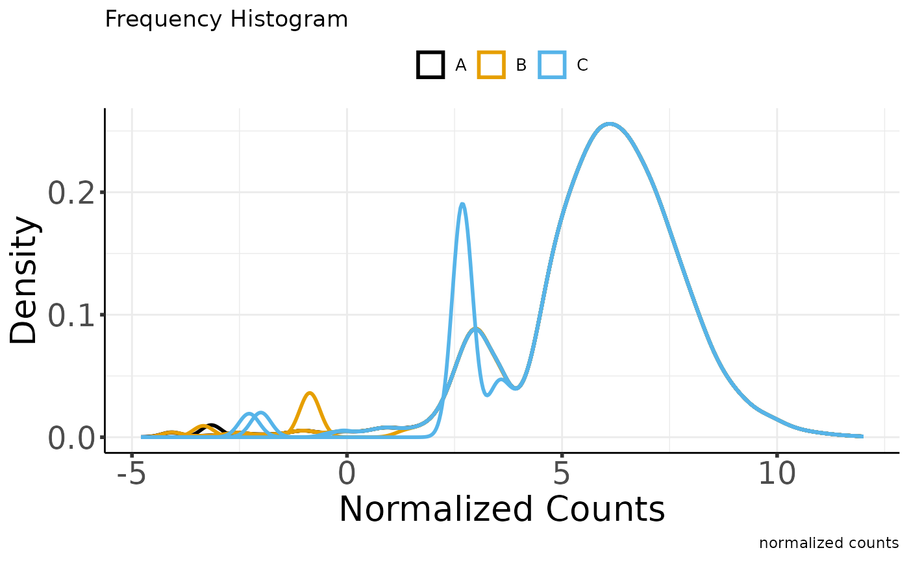
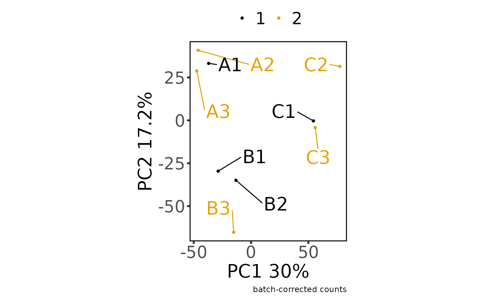
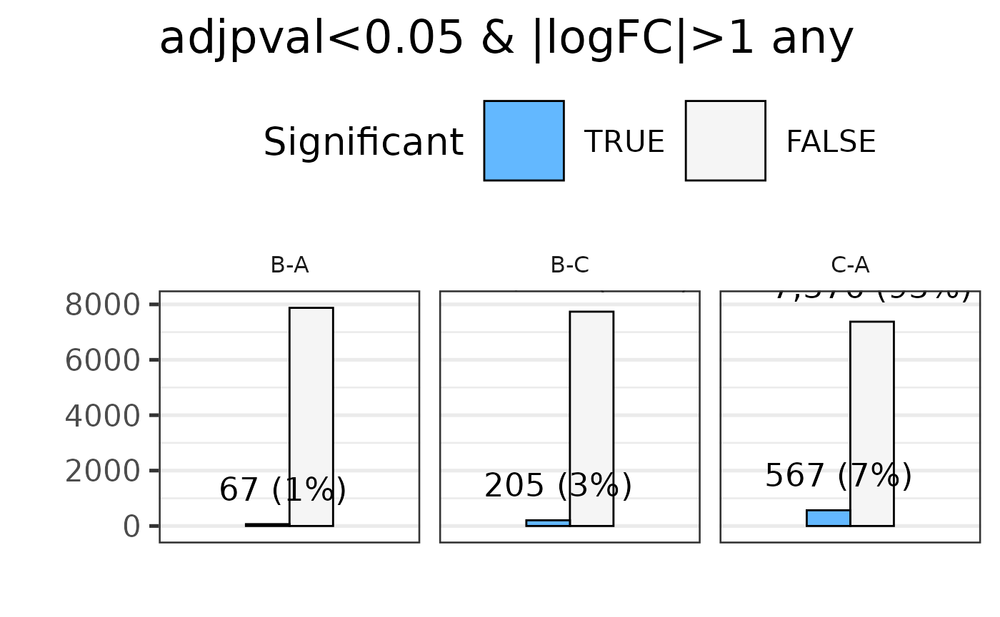

# Introduction to MultiOmicsSuite

``` r
library(MOSuite)
#> Warning: replacing previous import 'S4Arrays::makeNindexFromArrayViewport' by
#> 'DelayedArray::makeNindexFromArrayViewport' when loading 'SummarizedExperiment'
library(dplyr)
#> 
#> Attaching package: 'dplyr'
#> The following objects are masked from 'package:stats':
#> 
#>     filter, lag
#> The following objects are masked from 'package:base':
#> 
#>     intersect, setdiff, setequal, union
```

``` r
options(moo_print_plots = TRUE)

moo_nidap <- create_multiOmicDataSet_from_dataframes(
  sample_metadata = as.data.frame(nidap_sample_metadata),
  counts_dat = as.data.frame(nidap_raw_counts)
) %>%
  clean_raw_counts() %>%
  filter_counts(group_colname = "Group") %>%
  normalize_counts(group_colname = "Group") %>%
  batch_correct_counts(
    covariates_colname = "Group",
    batch_colname = "Batch",
    label_colname = "Label"
  ) %>%
  diff_counts(
    count_type = "filt",
    covariates_colnames = c("Group", "Batch"),
    contrast_colname = c("Group"),
    contrasts = c("B-A", "C-A", "B-C"),
    input_in_log_counts = FALSE,
    return_mean_and_sd = FALSE,
    voom_normalization_method = "quantile",
  ) %>%
  filter_diff()
```


    #> * cleaning raw counts
    #> Not able to identify multiple id's in GeneName
    #> Columns that can be used to aggregate gene information GeneName
    #> Aggregating the counts for the same ID in different chromosome locations.
    #> Column used to Aggregate duplicate IDs: GeneName
    #> Number of rows before Collapse: 43280
    #> no duplicated IDs in GeneName
    #> * filtering clean counts
    #> Number of features after filtering: 7943



    #> * normalizing filt counts
    #> Total number of features included: 7943
    #> Warning: ggrepel: 1 unlabeled data points (too many overlaps). Consider
    #> increasing max.overlaps



    #> Sample columns: A1, Sample columns: A2, Sample columns: A3, Sample columns: B1, Sample columns: B2, Sample columns: B3, Sample columns: C1, Sample columns: C2, Sample columns: C3
    #> * batch-correcting norm-voom counts
    #> Found2batches
    #> Adjusting for2covariate(s) or covariate level(s)
    #> Standardizing Data across genes
    #> Fitting L/S model and finding priors
    #> Finding parametric adjustments
    #> Adjusting the Data



    #> The total number of features in output: 7943
    #> Number of samples after batch correction: 10
    #> * differential counts
    #> Setting first column of `counts` as gene annotation.
    #> Total number of genes included: 7943
    #> `geom_smooth()` using method = 'gam' and formula = 'y ~ s(x, bs = "cs")'


    #> Joining with `by = join_by(GeneName)`
    #> Joining with `by = join_by(GeneName)`
    #> * filtering differential features
    #> Total number of genes selected with adjpval < 0.05 and | logFC | ≥ 1 is
    #> sum(selgenes)



``` r

moo_nidap@analyses$diff %>%
  join_dfs_wide() %>%
  head()
#> Joining with `by = join_by(GeneName)`
#> Joining with `by = join_by(GeneName)`
#>   GeneName   B-A_FC  B-A_logFC B-A_tstat  B-A_pval B-A_adjpval    C-A_FC
#> 1   Mrpl15 1.059250 0.08304265 0.2377167 0.8162052   0.9682636 -1.068725
#> 2   Lypla1 1.370909 0.45513310 1.1301522 0.2810081   0.7797612 -1.066981
#> 3    Tcea1 1.083699 0.11596469 0.3657617 0.7210585   0.9500109 -1.177051
#> 4  Atp6v1h 1.311199 0.39088683 1.1241780 0.2834330   0.7825194 -1.221374
#> 5   Rb1cc1 1.514888 0.59921070 1.3095182 0.2154459   0.7187843  1.313927
#> 6   Pcmtd1 1.112738 0.15411405 0.2497788 0.8070821   0.9663212  3.238362
#>     C-A_logFC  C-A_tstat    C-A_pval C-A_adjpval    B-C_FC  B-C_logFC
#> 1 -0.09589040 -0.2897955 0.777035116  0.89204033  1.132046  0.1789331
#> 2 -0.09353458 -0.2379598 0.816021040  0.91228196  1.462734  0.5486677
#> 3 -0.23517638 -0.7602905 0.462100568  0.69160897  1.275569  0.3511411
#> 4 -0.28850521 -0.8324070 0.421815393  0.65837683  1.601465  0.6793920
#> 5  0.39388567  0.9073581 0.382492765  0.62547476  1.152946  0.2053250
#> 6  1.69526432  3.4021010 0.005417489  0.05722644 -2.910264 -1.5411503
#>    B-C_tstat   B-C_pval B-C_adjpval
#> 1  0.5285947 0.60695058   0.8355016
#> 2  1.3910079 0.19006353   0.4871490
#> 3  1.1281746 0.28180907   0.5893629
#> 4  1.9865449 0.07085778   0.3168579
#> 5  0.4843119 0.63708764   0.8518020
#> 6 -2.9536960 0.01233497   0.1411803

moo_nidap@analyses$diff_filt %>% head()
#>   GeneName B-A_FC B-A_logFC B-A_tstat B-A_pval B-A_adjpval C-A_FC C-A_logFC
#> 1     Rrs1  -2.06    -1.040    -2.860   0.0147       0.276  -2.71     -1.44
#> 2     Mcm3  -1.45    -0.539    -1.870   0.0869       0.544  -2.45     -1.29
#> 3   Ogfrl1   1.07     0.102     0.292   0.7750       0.960  -3.78     -1.92
#> 4    Smap1   2.96     1.570     2.010   0.0684       0.499   5.68      2.51
#> 5  Plekhb2  -1.24    -0.312    -1.100   0.2950       0.789   2.69      1.43
#> 6   Il18r1   2.41     1.270     0.706   0.4940       0.875  36.40      5.19
#>   C-A_tstat C-A_pval C-A_adjpval B-C_FC B-C_logFC B-C_tstat B-C_pval
#> 1     -3.83 2.48e-03     0.03680   1.32     0.399     0.941 3.66e-01
#> 2     -4.33 1.03e-03     0.02240   1.69     0.755     2.380 3.53e-02
#> 3     -4.04 1.71e-03     0.03030   4.05     2.020     4.030 1.76e-03
#> 4      3.59 3.82e-03     0.04700  -1.92    -0.938    -1.750 1.07e-01
#> 5      5.99 6.94e-05     0.00463  -3.34    -1.740    -6.980 1.66e-05
#> 6      3.13 8.86e-03     0.07640 -15.10    -3.920    -4.230 1.23e-03
#>   B-C_adjpval
#> 1      0.6660
#> 2      0.2300
#> 3      0.0550
#> 4      0.3780
#> 5      0.0033
#> 6      0.0455
```

## The multiOmicDataSet object structure

``` r
str(moo_nidap)
#> <MOSuite::multiOmicDataSet>
#>  @ sample_meta:'data.frame': 9 obs. of  5 variables:
#>  .. $ Sample   : chr  "A1" "A2" "A3" "B1" ...
#>  .. $ Group    : chr  "A" "A" "A" "B" ...
#>  .. $ Replicate: num  1 2 3 1 2 3 1 2 3
#>  .. $ Batch    : num  1 2 2 1 1 2 1 2 2
#>  .. $ Label    : chr  "A1" "A2" "A3" "B1" ...
#>  .. - attr(*, "spec")=List of 3
#>  ..  ..$ cols   :List of 5
#>  ..  .. ..$ Sample   : list()
#>  ..  .. .. ..- attr(*, "class")= chr [1:2] "collector_character" "collector"
#>  ..  .. ..$ Group    : list()
#>  ..  .. .. ..- attr(*, "class")= chr [1:2] "collector_character" "collector"
#>  ..  .. ..$ Replicate: list()
#>  ..  .. .. ..- attr(*, "class")= chr [1:2] "collector_double" "collector"
#>  ..  .. ..$ Batch    : list()
#>  ..  .. .. ..- attr(*, "class")= chr [1:2] "collector_double" "collector"
#>  ..  .. ..$ Label    : list()
#>  ..  .. .. ..- attr(*, "class")= chr [1:2] "collector_character" "collector"
#>  ..  ..$ default: list()
#>  ..  .. ..- attr(*, "class")= chr [1:2] "collector_guess" "collector"
#>  ..  ..$ delim  : chr ","
#>  ..  ..- attr(*, "class")= chr "col_spec"
#>  .. - attr(*, "problems")=<externalptr> 
#>  @ annotation :'data.frame': 43280 obs. of  1 variable:
#>  .. $ GeneName: chr  "RP23-271O17.1" "Gm26206" "Xkr4" "RP23-317L18.1" ...
#>  .. - attr(*, "spec")=List of 3
#>  ..  ..$ cols   :List of 10
#>  ..  .. ..$ GeneName: list()
#>  ..  .. .. ..- attr(*, "class")= chr [1:2] "collector_character" "collector"
#>  ..  .. ..$ A1      : list()
#>  ..  .. .. ..- attr(*, "class")= chr [1:2] "collector_double" "collector"
#>  ..  .. ..$ A2      : list()
#>  ..  .. .. ..- attr(*, "class")= chr [1:2] "collector_double" "collector"
#>  ..  .. ..$ A3      : list()
#>  ..  .. .. ..- attr(*, "class")= chr [1:2] "collector_double" "collector"
#>  ..  .. ..$ B1      : list()
#>  ..  .. .. ..- attr(*, "class")= chr [1:2] "collector_double" "collector"
#>  ..  .. ..$ B2      : list()
#>  ..  .. .. ..- attr(*, "class")= chr [1:2] "collector_double" "collector"
#>  ..  .. ..$ B3      : list()
#>  ..  .. .. ..- attr(*, "class")= chr [1:2] "collector_double" "collector"
#>  ..  .. ..$ C1      : list()
#>  ..  .. .. ..- attr(*, "class")= chr [1:2] "collector_double" "collector"
#>  ..  .. ..$ C2      : list()
#>  ..  .. .. ..- attr(*, "class")= chr [1:2] "collector_double" "collector"
#>  ..  .. ..$ C3      : list()
#>  ..  .. .. ..- attr(*, "class")= chr [1:2] "collector_double" "collector"
#>  ..  ..$ default: list()
#>  ..  .. ..- attr(*, "class")= chr [1:2] "collector_guess" "collector"
#>  ..  ..$ delim  : chr ","
#>  ..  ..- attr(*, "class")= chr "col_spec"
#>  .. - attr(*, "problems")=<externalptr> 
#>  @ counts     :List of 5
#>  .. $ raw  :'data.frame':    43280 obs. of  10 variables:
#>  ..  ..$ GeneName: chr [1:43280] "RP23-271O17.1" "Gm26206" "Xkr4" "RP23-317L18.1" ...
#>  ..  ..$ A1      : num [1:43280] 0 0 0 0 0 0 0 0 0 0 ...
#>  ..  ..$ A2      : num [1:43280] 0 0 0 0 0 0 0 0 0 0 ...
#>  ..  ..$ A3      : num [1:43280] 0 0 0 0 0 0 0 0 0 0 ...
#>  ..  ..$ B1      : num [1:43280] 0 0 0 0 0 0 0 0 0 0 ...
#>  ..  ..$ B2      : num [1:43280] 0 0 0 0 0 0 0 0 0 1 ...
#>  ..  ..$ B3      : num [1:43280] 0 0 0 0 0 0 0 0 0 0 ...
#>  ..  ..$ C1      : num [1:43280] 0 0 0 0 0 0 0 0 0 0 ...
#>  ..  ..$ C2      : num [1:43280] 0 0 0 0 0 0 0 0 0 0 ...
#>  ..  ..$ C3      : num [1:43280] 0 0 0 0 0 0 0 0 0 0 ...
#>  ..  ..- attr(*, "spec")=List of 3
#>  ..  .. ..$ cols   :List of 10
#>  ..  .. .. ..$ GeneName: list()
#>  ..  .. .. .. ..- attr(*, "class")= chr [1:2] "collector_character" "collector"
#>  ..  .. .. ..$ A1      : list()
#>  ..  .. .. .. ..- attr(*, "class")= chr [1:2] "collector_double" "collector"
#>  ..  .. .. ..$ A2      : list()
#>  ..  .. .. .. ..- attr(*, "class")= chr [1:2] "collector_double" "collector"
#>  ..  .. .. ..$ A3      : list()
#>  ..  .. .. .. ..- attr(*, "class")= chr [1:2] "collector_double" "collector"
#>  ..  .. .. ..$ B1      : list()
#>  ..  .. .. .. ..- attr(*, "class")= chr [1:2] "collector_double" "collector"
#>  ..  .. .. ..$ B2      : list()
#>  ..  .. .. .. ..- attr(*, "class")= chr [1:2] "collector_double" "collector"
#>  ..  .. .. ..$ B3      : list()
#>  ..  .. .. .. ..- attr(*, "class")= chr [1:2] "collector_double" "collector"
#>  ..  .. .. ..$ C1      : list()
#>  ..  .. .. .. ..- attr(*, "class")= chr [1:2] "collector_double" "collector"
#>  ..  .. .. ..$ C2      : list()
#>  ..  .. .. .. ..- attr(*, "class")= chr [1:2] "collector_double" "collector"
#>  ..  .. .. ..$ C3      : list()
#>  ..  .. .. .. ..- attr(*, "class")= chr [1:2] "collector_double" "collector"
#>  ..  .. ..$ default: list()
#>  ..  .. .. ..- attr(*, "class")= chr [1:2] "collector_guess" "collector"
#>  ..  .. ..$ delim  : chr ","
#>  ..  .. ..- attr(*, "class")= chr "col_spec"
#>  ..  ..- attr(*, "problems")=<externalptr> 
#>  .. $ clean:'data.frame':    43280 obs. of  10 variables:
#>  ..  ..$ GeneName: chr [1:43280] "RP23-271O17.1" "Gm26206" "Xkr4" "RP23-317L18.1" ...
#>  ..  ..$ A1      : num [1:43280] 0 0 0 0 0 0 0 0 0 0 ...
#>  ..  ..$ A2      : num [1:43280] 0 0 0 0 0 0 0 0 0 0 ...
#>  ..  ..$ A3      : num [1:43280] 0 0 0 0 0 0 0 0 0 0 ...
#>  ..  ..$ B1      : num [1:43280] 0 0 0 0 0 0 0 0 0 0 ...
#>  ..  ..$ B2      : num [1:43280] 0 0 0 0 0 0 0 0 0 1 ...
#>  ..  ..$ B3      : num [1:43280] 0 0 0 0 0 0 0 0 0 0 ...
#>  ..  ..$ C1      : num [1:43280] 0 0 0 0 0 0 0 0 0 0 ...
#>  ..  ..$ C2      : num [1:43280] 0 0 0 0 0 0 0 0 0 0 ...
#>  ..  ..$ C3      : num [1:43280] 0 0 0 0 0 0 0 0 0 0 ...
#>  ..  ..- attr(*, "spec")=List of 3
#>  ..  .. ..$ cols   :List of 10
#>  ..  .. .. ..$ GeneName: list()
#>  ..  .. .. .. ..- attr(*, "class")= chr [1:2] "collector_character" "collector"
#>  ..  .. .. ..$ A1      : list()
#>  ..  .. .. .. ..- attr(*, "class")= chr [1:2] "collector_double" "collector"
#>  ..  .. .. ..$ A2      : list()
#>  ..  .. .. .. ..- attr(*, "class")= chr [1:2] "collector_double" "collector"
#>  ..  .. .. ..$ A3      : list()
#>  ..  .. .. .. ..- attr(*, "class")= chr [1:2] "collector_double" "collector"
#>  ..  .. .. ..$ B1      : list()
#>  ..  .. .. .. ..- attr(*, "class")= chr [1:2] "collector_double" "collector"
#>  ..  .. .. ..$ B2      : list()
#>  ..  .. .. .. ..- attr(*, "class")= chr [1:2] "collector_double" "collector"
#>  ..  .. .. ..$ B3      : list()
#>  ..  .. .. .. ..- attr(*, "class")= chr [1:2] "collector_double" "collector"
#>  ..  .. .. ..$ C1      : list()
#>  ..  .. .. .. ..- attr(*, "class")= chr [1:2] "collector_double" "collector"
#>  ..  .. .. ..$ C2      : list()
#>  ..  .. .. .. ..- attr(*, "class")= chr [1:2] "collector_double" "collector"
#>  ..  .. .. ..$ C3      : list()
#>  ..  .. .. .. ..- attr(*, "class")= chr [1:2] "collector_double" "collector"
#>  ..  .. ..$ default: list()
#>  ..  .. .. ..- attr(*, "class")= chr [1:2] "collector_guess" "collector"
#>  ..  .. ..$ delim  : chr ","
#>  ..  .. ..- attr(*, "class")= chr "col_spec"
#>  ..  ..- attr(*, "problems")=<externalptr> 
#>  .. $ filt :'data.frame':    7943 obs. of  10 variables:
#>  ..  ..$ GeneName: chr [1:7943] "Mrpl15" "Lypla1" "Tcea1" "Atp6v1h" ...
#>  ..  ..$ A1      : num [1:7943] 1245 1483 1381 1033 666 ...
#>  ..  ..$ A2      : num [1:7943] 1341 1410 2044 1959 1397 ...
#>  ..  ..$ A3      : num [1:7943] 1476 1370 2051 1890 1576 ...
#>  ..  ..$ B1      : num [1:7943] 965 1146 2325 2075 681 ...
#>  ..  ..$ B2      : num [1:7943] 1235 1422 2386 2702 2040 ...
#>  ..  ..$ B3      : num [1:7943] 1784 2624 1893 2150 1988 ...
#>  ..  ..$ C1      : num [1:7943] 1058 991 2391 2436 774 ...
#>  ..  ..$ C2      : num [1:7943] 1732 1101 916 1321 1921 ...
#>  ..  ..$ C3      : num [1:7943] 1531 2352 2261 1018 2660 ...
#>  ..  ..- attr(*, "spec")=List of 3
#>  ..  .. ..$ cols   :List of 10
#>  ..  .. .. ..$ GeneName: list()
#>  ..  .. .. .. ..- attr(*, "class")= chr [1:2] "collector_character" "collector"
#>  ..  .. .. ..$ A1      : list()
#>  ..  .. .. .. ..- attr(*, "class")= chr [1:2] "collector_double" "collector"
#>  ..  .. .. ..$ A2      : list()
#>  ..  .. .. .. ..- attr(*, "class")= chr [1:2] "collector_double" "collector"
#>  ..  .. .. ..$ A3      : list()
#>  ..  .. .. .. ..- attr(*, "class")= chr [1:2] "collector_double" "collector"
#>  ..  .. .. ..$ B1      : list()
#>  ..  .. .. .. ..- attr(*, "class")= chr [1:2] "collector_double" "collector"
#>  ..  .. .. ..$ B2      : list()
#>  ..  .. .. .. ..- attr(*, "class")= chr [1:2] "collector_double" "collector"
#>  ..  .. .. ..$ B3      : list()
#>  ..  .. .. .. ..- attr(*, "class")= chr [1:2] "collector_double" "collector"
#>  ..  .. .. ..$ C1      : list()
#>  ..  .. .. .. ..- attr(*, "class")= chr [1:2] "collector_double" "collector"
#>  ..  .. .. ..$ C2      : list()
#>  ..  .. .. .. ..- attr(*, "class")= chr [1:2] "collector_double" "collector"
#>  ..  .. .. ..$ C3      : list()
#>  ..  .. .. .. ..- attr(*, "class")= chr [1:2] "collector_double" "collector"
#>  ..  .. ..$ default: list()
#>  ..  .. .. ..- attr(*, "class")= chr [1:2] "collector_guess" "collector"
#>  ..  .. ..$ delim  : chr ","
#>  ..  .. ..- attr(*, "class")= chr "col_spec"
#>  ..  ..- attr(*, "problems")=<externalptr> 
#>  .. $ norm :List of 1
#>  ..  ..$ voom:'data.frame':  7943 obs. of  10 variables:
#>  ..  .. ..$ GeneName: chr [1:7943] "Mrpl15" "Lypla1" "Tcea1" "Atp6v1h" ...
#>  ..  .. ..$ A1      : num [1:7943] 6.79 7.04 6.93 6.51 5.85 ...
#>  ..  .. ..$ A2      : num [1:7943] 6.7 6.78 7.32 7.26 6.76 ...
#>  ..  .. ..$ A3      : num [1:7943] 6.64 6.53 7.13 7 6.75 ...
#>  ..  .. ..$ B1      : num [1:7943] 6.22 6.47 7.48 7.31 5.75 ...
#>  ..  .. ..$ B2      : num [1:7943] 6.38 6.57 7.33 7.52 7.11 ...
#>  ..  .. ..$ B3      : num [1:7943] 7.02 7.59 7.11 7.3 7.17 ...
#>  ..  .. ..$ C1      : num [1:7943] 6.02 5.92 7.19 7.22 5.56 ...
#>  ..  .. ..$ C2      : num [1:7943] 7.03 6.43 6.19 6.67 7.19 ...
#>  ..  .. ..$ C3      : num [1:7943] 6.6 7.25 7.2 6.01 7.43 ...
#>  .. $ batch:'data.frame':    7943 obs. of  10 variables:
#>  ..  ..$ GeneName: chr [1:7943] "Mrpl15" "Lypla1" "Tcea1" "Atp6v1h" ...
#>  ..  ..$ A1      : num [1:7943] 6.92 7.2 6.87 6.51 6.23 ...
#>  ..  ..$ A2      : num [1:7943] 6.59 6.66 7.33 7.25 6.46 ...
#>  ..  ..$ A3      : num [1:7943] 6.54 6.43 7.16 7.02 6.45 ...
#>  ..  ..$ B1      : num [1:7943] 6.41 6.68 7.42 7.28 6.27 ...
#>  ..  ..$ B2      : num [1:7943] 6.55 6.78 7.27 7.47 7.35 ...
#>  ..  ..$ B3      : num [1:7943] 6.88 7.4 7.16 7.33 6.89 ...
#>  ..  ..$ C1      : num [1:7943] 6.21 6.13 7.13 7.13 6.06 ...
#>  ..  ..$ C2      : num [1:7943] 6.87 6.32 6.32 6.69 6.88 ...
#>  ..  ..$ C3      : num [1:7943] 6.48 7.04 7.18 6.1 7.1 ...
#>  @ analyses   :List of 3
#>  .. $ colors   :List of 5
#>  ..  ..$ Sample   : Named chr [1:9] "#000000" "#E69F00" "#56B4E9" "#009E73" ...
#>  ..  .. ..- attr(*, "names")= chr [1:9] "A1" "A2" "A3" "B1" ...
#>  ..  ..$ Group    : Named chr [1:3] "#000000" "#E69F00" "#56B4E9"
#>  ..  .. ..- attr(*, "names")= chr [1:3] "A" "B" "C"
#>  ..  ..$ Replicate: Named chr [1:3] "#000000" "#E69F00" "#56B4E9"
#>  ..  .. ..- attr(*, "names")= chr [1:3] "1" "2" "3"
#>  ..  ..$ Batch    : Named chr [1:2] "#000000" "#E69F00"
#>  ..  .. ..- attr(*, "names")= chr [1:2] "1" "2"
#>  ..  ..$ Label    : Named chr [1:9] "#000000" "#E69F00" "#56B4E9" "#009E73" ...
#>  ..  .. ..- attr(*, "names")= chr [1:9] "A1" "A2" "A3" "B1" ...
#>  .. $ diff     :List of 3
#>  ..  ..$ B-A:'data.frame':   7943 obs. of  6 variables:
#>  ..  .. ..$ GeneName: chr [1:7943] "Mrpl15" "Lypla1" "Tcea1" "Atp6v1h" ...
#>  ..  .. ..$ FC      : num [1:7943] 1.06 1.37 1.08 1.31 1.51 ...
#>  ..  .. ..$ logFC   : num [1:7943] 0.083 0.455 0.116 0.391 0.599 ...
#>  ..  .. ..$ tstat   : num [1:7943] 0.238 1.13 0.366 1.124 1.31 ...
#>  ..  .. ..$ pval    : num [1:7943] 0.816 0.281 0.721 0.283 0.215 ...
#>  ..  .. ..$ adjpval : num [1:7943] 0.968 0.78 0.95 0.783 0.719 ...
#>  ..  ..$ C-A:'data.frame':   7943 obs. of  6 variables:
#>  ..  .. ..$ GeneName: chr [1:7943] "Mrpl15" "Lypla1" "Tcea1" "Atp6v1h" ...
#>  ..  .. ..$ FC      : num [1:7943] -1.07 -1.07 -1.18 -1.22 1.31 ...
#>  ..  .. ..$ logFC   : num [1:7943] -0.0959 -0.0935 -0.2352 -0.2885 0.3939 ...
#>  ..  .. ..$ tstat   : num [1:7943] -0.29 -0.238 -0.76 -0.832 0.907 ...
#>  ..  .. ..$ pval    : num [1:7943] 0.777 0.816 0.462 0.422 0.382 ...
#>  ..  .. ..$ adjpval : num [1:7943] 0.892 0.912 0.692 0.658 0.625 ...
#>  ..  ..$ B-C:'data.frame':   7943 obs. of  6 variables:
#>  ..  .. ..$ GeneName: chr [1:7943] "Mrpl15" "Lypla1" "Tcea1" "Atp6v1h" ...
#>  ..  .. ..$ FC      : num [1:7943] 1.13 1.46 1.28 1.6 1.15 ...
#>  ..  .. ..$ logFC   : num [1:7943] 0.179 0.549 0.351 0.679 0.205 ...
#>  ..  .. ..$ tstat   : num [1:7943] 0.529 1.391 1.128 1.987 0.484 ...
#>  ..  .. ..$ pval    : num [1:7943] 0.607 0.1901 0.2818 0.0709 0.6371 ...
#>  ..  .. ..$ adjpval : num [1:7943] 0.836 0.487 0.589 0.317 0.852 ...
#>  .. $ diff_filt:'data.frame':    635 obs. of  16 variables:
#>  ..  ..$ GeneName   : chr [1:635] "Rrs1" "Mcm3" "Ogfrl1" "Smap1" ...
#>  ..  ..$ B-A_FC     : num [1:635] -2.06 -1.45 1.07 2.96 -1.24 2.41 -1.63 2.41 53.5 1.63 ...
#>  ..  ..$ B-A_logFC  : num [1:635] -1.04 -0.539 0.102 1.57 -0.312 1.27 -0.706 1.27 5.74 0.708 ...
#>  ..  ..$ B-A_tstat  : num [1:635] -2.86 -1.87 0.292 2.01 -1.1 0.706 -1.9 3.2 3.64 1.91 ...
#>  ..  ..$ B-A_pval   : num [1:635] 0.0147 0.0869 0.775 0.0684 0.295 0.494 0.0827 0.00784 0.00354 0.0804 ...
#>  ..  ..$ B-A_adjpval: num [1:635] 0.276 0.544 0.96 0.499 0.789 0.875 0.535 0.21 0.142 0.53 ...
#>  ..  ..$ C-A_FC     : num [1:635] -2.71 -2.45 -3.78 5.68 2.69 36.4 3.13 2.74 287 -6.39 ...
#>  ..  ..$ C-A_logFC  : num [1:635] -1.44 -1.29 -1.92 2.51 1.43 5.19 1.64 1.46 8.17 -2.68 ...
#>  ..  ..$ C-A_tstat  : num [1:635] -3.83 -4.33 -4.04 3.59 5.99 3.13 5.63 3.97 5.42 -3.83 ...
#>  ..  ..$ C-A_pval   : num [1:635] 2.48e-03 1.03e-03 1.71e-03 3.82e-03 6.94e-05 8.86e-03 1.22e-04 1.94e-03 1.68e-04 2.50e-03 ...
#>  ..  ..$ C-A_adjpval: num [1:635] 0.0368 0.0224 0.0303 0.047 0.00463 0.0764 0.00644 0.0322 0.00784 0.0369 ...
#>  ..  ..$ B-C_FC     : num [1:635] 1.32 1.69 4.05 -1.92 -3.34 -15.1 -5.1 -1.14 -5.37 10.4 ...
#>  ..  ..$ B-C_logFC  : num [1:635] 0.399 0.755 2.02 -0.938 -1.74 -3.92 -2.35 -0.189 -2.42 3.38 ...
#>  ..  ..$ B-C_tstat  : num [1:635] 0.941 2.38 4.03 -1.75 -6.98 -4.23 -7.09 -0.583 -4.01 4.57 ...
#>  ..  ..$ B-C_pval   : num [1:635] 3.66e-01 3.53e-02 1.76e-03 1.07e-01 1.66e-05 1.23e-03 1.44e-05 5.71e-01 1.82e-03 6.84e-04 ...
#>  ..  ..$ B-C_adjpval: num [1:635] 0.666 0.23 0.055 0.378 0.0033 0.0455 0.00309 0.816 0.0562 0.0333 ...
```
