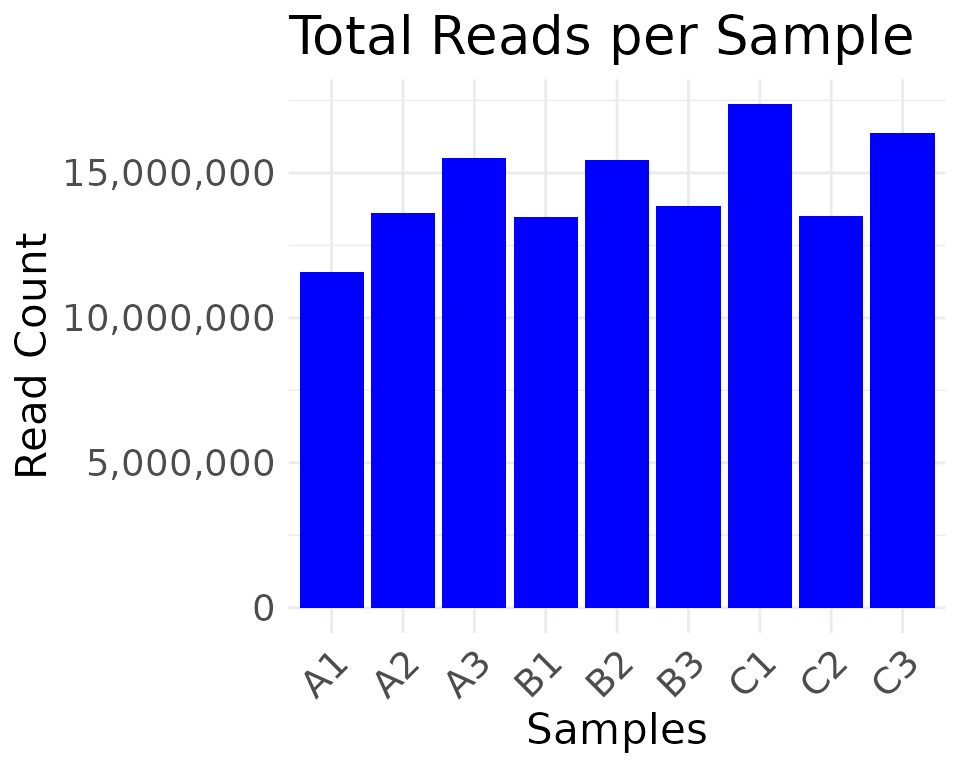
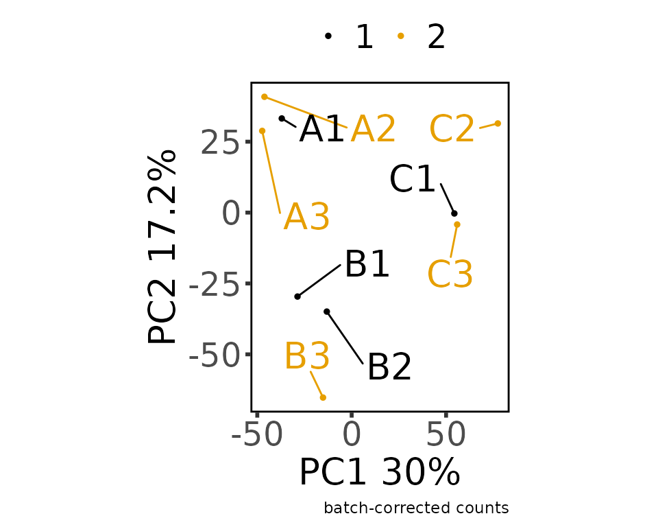
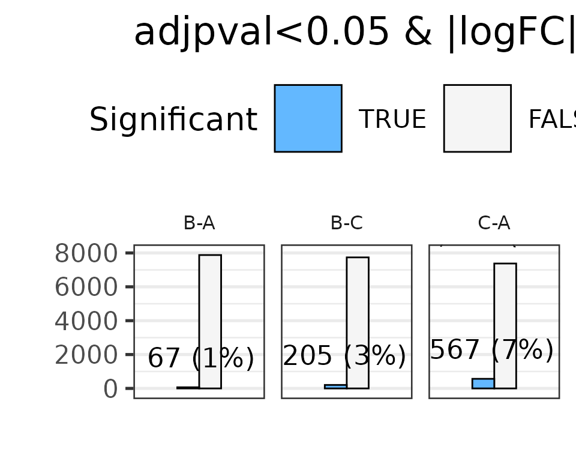
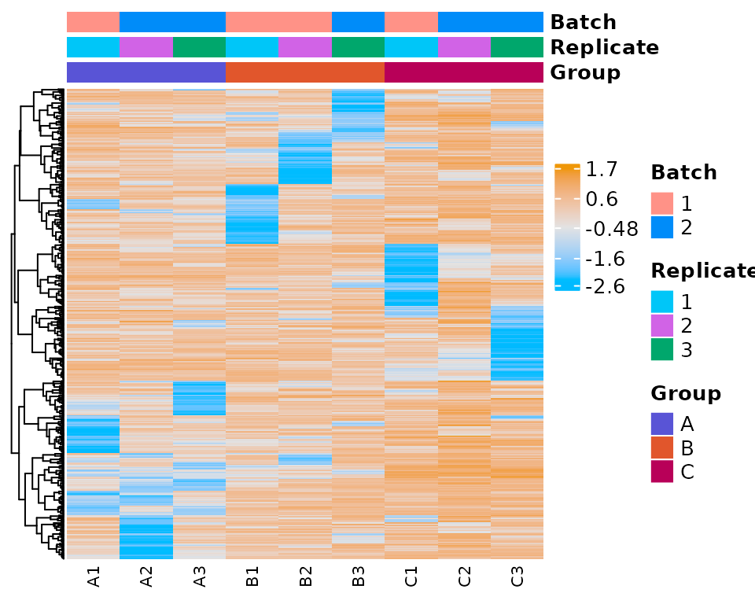

# Visualization with built-in plots

``` r
library(MOSuite)
#> Warning: replacing previous import 'S4Arrays::makeNindexFromArrayViewport' by
#> 'DelayedArray::makeNindexFromArrayViewport' when loading 'SummarizedExperiment'
```

## Default plots from each step

Default plots can be printed to the screen and/or saved to the disk.

``` r
# set options to print & save the plots
options(moo_print_plots = TRUE)
options(moo_save_plots = TRUE)
# when moo_save_plots is TRUE, plots are saved to this directory:
options(moo_plots_dir = "./figures")
```

See
[`?MOSuite::options`](https://ccbr.github.io/MOSuite/dev/reference/options.md)
for more information.

### clean

``` r
moo <- create_multiOmicDataSet_from_dataframes(
  sample_metadata = as.data.frame(nidap_sample_metadata),
  counts_dat = as.data.frame(nidap_raw_counts)
) %>%
  clean_raw_counts()
```



    #> Saving 5 x 4 in image
    #> * cleaning raw counts
    #> 
    #> Not able to identify multiple id's in GeneName
    #> 
    #> Columns that can be used to aggregate gene information GeneName
    #> 
    #> Aggregating the counts for the same ID in different chromosome locations.
    #> Column used to Aggregate duplicate IDs: GeneName
    #> Number of rows before Collapse: 43280
    #> 
    #> no duplicated IDs in GeneName

``` r
moo <- moo %>%
  filter_counts(group_colname = "Group")
#> * filtering clean counts
#> Number of features after filtering: 7943
#> colors_for_plots NULL
#> colors_for_plots character
```


    #> Warning: ggrepel: 1 unlabeled data points (too many overlaps). Consider
    #> increasing max.overlaps


    #> Saving 5 x 4 in image
    #> Warning: ggrepel: 1 unlabeled data points (too many overlaps). Consider
    #> increasing max.overlaps


    #> Saving 5 x 4 in image

### normalize

``` r
moo <- moo %>%
  normalize_counts(group_colname = "Group")
#> * normalizing filt counts
#> Total number of features included: 7943
```


    #> Warning: ggrepel: 3 unlabeled data points (too many overlaps). Consider
    #> increasing max.overlaps


    #> Saving 5 x 4 in image
    #> Warning: ggrepel: 3 unlabeled data points (too many overlaps). Consider
    #> increasing max.overlaps


    #> Saving 5 x 4 in image
    #> Sample columns: A1, Sample columns: A2, Sample columns: A3, Sample columns: B1, Sample columns: B2, Sample columns: B3, Sample columns: C1, Sample columns: C2, Sample columns: C3

### batch correct

``` r
moo <- moo %>%
  batch_correct_counts(
    covariates_colname = "Group",
    batch_colname = "Batch",
    label_colname = "Label"
  )
#> * batch-correcting norm-voom counts
#> Found2batches
#> Adjusting for2covariate(s) or covariate level(s)
#> Standardizing Data across genes
#> Fitting L/S model and finding priors
#> Finding parametric adjustments
#> Adjusting the Data
```



    #> Saving 5 x 4 in image


    #> Saving 5 x 4 in image


    #> The total number of features in output: 7943
    #> Number of samples after batch correction: 10

### differential expression

``` r
moo <- moo %>%
  diff_counts(
    count_type = "filt",
    covariates_colnames = c("Group", "Batch"),
    contrast_colname = c("Group"),
    contrasts = c("B-A", "C-A", "B-C"),
    input_in_log_counts = FALSE,
    return_mean_and_sd = FALSE,
    voom_normalization_method = "quantile",
  )
#> * differential counts
#> Setting first column of `counts` as gene annotation.
#> Total number of genes included: 7943
#> `geom_smooth()` using method = 'gam' and formula = 'y ~ s(x, bs = "cs")'
```


    #> Saving 5 x 4 in image
    #> `geom_smooth()` using method = 'gam' and formula = 'y ~ s(x, bs = "cs")'

### filter differential features

``` r
moo <- moo %>% filter_diff()
#> Joining with `by = join_by(GeneName)`
#> Joining with `by = join_by(GeneName)`
#> * filtering differential features
#> Total number of genes selected with adjpval < 0.05 and | logFC | ≥ 1 is
#> sum(selgenes)
```



    #> Saving 5 x 4 in image

## Customize plots

TODO

- show how to use individual plotting functions
- how to customize & override default color palettes
- how to customize ggplot objects

### 3D PCA

``` r
plot_pca(moo@counts$batch,
  moo@sample_meta,
  principal_components = c(1, 2, 3),
  group_colname = "Group",
  label_colname = "Label",
  color_values = moo@analyses[["colors"]][["Group"]]
)
```

### Expression Heatmap

``` r
heatmap_plot <- plot_expr_heatmap(moo, count_type = "norm", sub_count_type = "voom")
#> Warning: `arrange_()` was deprecated in dplyr 0.7.0.
#> ℹ Please use `arrange()` instead.
#> ℹ See vignette('programming') for more help
#> ℹ The deprecated feature was likely used in the MOSuite package.
#>   Please report the issue at <https://github.com/CCBR/MOSuite/issues>.
#> This warning is displayed once per session.
#> Call `lifecycle::last_lifecycle_warnings()` to see where this warning was
#> generated.
#> [1] "The total number of genes in heatmap: 500"
#> Warning: The input is a data frame, convert it to the matrix.
#> Warning: argument `height` is not supported in pheatmap -> Heatmap translation,
#> skip it.
```



``` r
print(heatmap_plot)
```


### Volcano

#### Summary

``` r
dat_volcano_summary <- moo@analyses$diff %>%
  join_dfs_wide() %>%
  plot_volcano_summary()
#> Joining with `by = join_by(GeneName)`
#> Joining with `by = join_by(GeneName)`
#> Preparing table for contrast: B-A
#> Fold change column: B-A_logFC
#> pval column: B-A_pval
#> Total number of features included in volcano plot: 7943
#> Preparing table for contrast: C-A
#> Fold change column: C-A_logFC
#> pval column: C-A_pval
#> Total number of features included in volcano plot: 7943
#> Preparing table for contrast: B-C
#> Fold change column: B-C_logFC
#> pval column: B-C_pval
#> Total number of features included in volcano plot: 7943
#> Warning: ggrepel: 27 unlabeled data points (too many overlaps). Consider
#> increasing max.overlaps
#> Warning: ggrepel: 29 unlabeled data points (too many overlaps). Consider increasing max.overlaps
#> ggrepel: 29 unlabeled data points (too many overlaps). Consider increasing max.overlaps
```


    #> Saving 5 x 4 in image
    #> Warning: ggrepel: 27 unlabeled data points (too many overlaps). Consider increasing max.overlaps
    #> ggrepel: 29 unlabeled data points (too many overlaps). Consider increasing max.overlaps
    #> ggrepel: 29 unlabeled data points (too many overlaps). Consider increasing max.overlaps

    head(dat_volcano_summary)
    #>       GeneName Contrast         FC     logFC     tstat         pval
    #> B-A.1     Dntt      B-A -42.746586 -5.417737 -15.68797 3.159343e-09
    #> B-A.2   Tmsb4x      B-A   3.850020  1.944866  12.91026 2.760555e-08
    #> B-A.3     Flt3      B-A  -7.714394 -2.947553 -11.38084 1.093405e-07
    #> B-A.4  Tspan13      B-A  -7.038498 -2.815268 -11.03127 1.531110e-07
    #> B-A.5    Tapt1      B-A  -5.291816 -2.403763 -10.65847 2.214593e-07
    #> B-A.6    Itgb7      B-A   8.873823  3.149556  10.56147 2.442070e-07
    #>            adjpval
    #> B-A.1 2.509467e-05
    #> B-A.2 1.096354e-04
    #> B-A.3 2.894973e-04
    #> B-A.4 3.040401e-04
    #> B-A.5 3.232894e-04
    #> B-A.6 3.232894e-04

#### Enhanced

``` r
dat_volcano_enhanced <- moo@analyses$diff %>%
  join_dfs_wide() %>%
  plot_volcano_enhanced()
#> Joining with `by = join_by(GeneName)`
#> Joining with `by = join_by(GeneName)`
#> Genes in initial dataset: 7943
#> Max y: 4.60041859457819
#> Genes in initial dataset: 7943
#> Max y: 4.32577808863472
```


### Venn Diagram

``` r
venn_dat <- dat_volcano_summary %>% plot_venn_diagram()
#> All intersections: 1:7,c(1, 2, 3, 4, 5, 6, 7),c(79, 119, 265, 493, 149, 271, 516),c("Yes", "Yes", "Yes", "Yes", "Yes", "Yes", "Yes")
#> Intersections returned: 1:7,c(1, 2, 3, 4, 5, 6, 7),c(79, 119, 265, 493, 149, 271, 516)
```


``` r
head(venn_dat)
#>    Gene      Intersection Id Size
#> 1  Dntt (B-A ∩ B-C ∩ C-A)  1   79
#> 2  Flt3 (B-A ∩ B-C ∩ C-A)  1   79
#> 3   Id2 (B-A ∩ B-C ∩ C-A)  1   79
#> 4 Eltd1 (B-A ∩ B-C ∩ C-A)  1   79
#> 5 Runx3 (B-A ∩ B-C ∩ C-A)  1   79
#> 6 Dusp6 (B-A ∩ B-C ∩ C-A)  1   79
```
