# MOSuite analysis report

# MOSuite analysis report

Published

July 28, 2026

``` r
library(MOSuite)
library(dplyr)
```

    Attaching package: 'dplyr'

    The following objects are masked from 'package:stats':

        filter, lag

    The following objects are masked from 'package:base':

        intersect, setdiff, setequal, union

``` r
library(knitr)
options(moo_print_plots = params$print_plots)
```

## Load data

``` r
# create multi-omic object
counts_csv <- params$counts_csv
if (is.null(counts_csv) || !nzchar(counts_csv) || !file.exists(counts_csv)) {
  counts_csv <- system.file(
    "extdata",
    "nidap",
    "Raw_Counts.csv.gz",
    package = "MOSuite"
  )
}

samplesheet_csv <- params$samplesheet_csv
if (
  is.null(samplesheet_csv) ||
    !nzchar(samplesheet_csv) ||
    !file.exists(samplesheet_csv)
) {
  samplesheet_csv <- system.file(
    "extdata",
    "nidap",
    "Sample_Metadata_Bulk_RNA-seq_Training_Dataset_CCBR.csv.gz",
    package = "MOSuite"
  )
}

moo <- create_multiOmicDataSet_from_files(
  sample_meta_filepath = samplesheet_csv,
  feature_counts_filepath = counts_csv
)
```

    Rows: 43280 Columns: 10
    ── Column specification ────────────────────────────────────────────────────────
    Delimiter: ","
    chr (1): GeneName
    dbl (9): A1, A2, A3, B1, B2, B3, C1, C2, C3

    ℹ Use `spec()` to retrieve the full column specification for this data.
    ℹ Specify the column types or set `show_col_types = FALSE` to quiet this message.
    Rows: 9 Columns: 5
    ── Column specification ────────────────────────────────────────────────────────
    Delimiter: ","
    chr (3): Sample, Group, Label
    dbl (2): Replicate, Batch

    ℹ Use `spec()` to retrieve the full column specification for this data.
    ℹ Specify the column types or set `show_col_types = FALSE` to quiet this message.

``` r
group_colname <- params$group_colname
batch_colname <- params$batch_colname
label_colname <- params$label_colname
contrasts_vctr <- params$contrasts
knitr::kable(
  data.frame(
    Parameter = names(params),
    Value = sapply(params, paste, collapse = ", ")
  ),
  caption = "Parameter values"
)
```

|                 | Parameter       | Value                                                                                                            |
|:----------------|:----------------|:-----------------------------------------------------------------------------------------------------------------|
| group_colname   | group_colname   | Group                                                                                                            |
| batch_colname   | batch_colname   | Batch                                                                                                            |
| label_colname   | label_colname   | Label                                                                                                            |
| contrasts       | contrasts       | B-A, C-A, B-C                                                                                                    |
| print_plots     | print_plots     | TRUE                                                                                                             |
| counts_csv      | counts_csv      | /home/runner/work/\_temp/Library/MOSuite/extdata/nidap/Raw_Counts.csv.gz                                         |
| samplesheet_csv | samplesheet_csv | /home/runner/work/\_temp/Library/MOSuite/extdata/nidap/Sample_Metadata_Bulk_RNA-seq_Training_Dataset_CCBR.csv.gz |

Parameter values

``` r
knitr::kable(
  readr::read_csv(samplesheet_csv, n_max = 10),
  caption = "Sample sheet (first 10 rows)"
)
```

    Rows: 9 Columns: 5
    ── Column specification ────────────────────────────────────────────────────────
    Delimiter: ","
    chr (3): Sample, Group, Label
    dbl (2): Replicate, Batch

    ℹ Use `spec()` to retrieve the full column specification for this data.
    ℹ Specify the column types or set `show_col_types = FALSE` to quiet this message.

| Sample | Group | Replicate | Batch | Label |
|:-------|:------|----------:|------:|:------|
| A1     | A     |         1 |     1 | A1    |
| A2     | A     |         2 |     2 | A2    |
| A3     | A     |         3 |     2 | A3    |
| B1     | B     |         1 |     1 | B1    |
| B2     | B     |         2 |     1 | B2    |
| B3     | B     |         3 |     2 | B3    |
| C1     | C     |         1 |     1 | C1    |
| C2     | C     |         2 |     2 | C2    |
| C3     | C     |         3 |     2 | C3    |

Sample sheet (first 10 rows)

``` r
knitr::kable(
  readr::read_csv(counts_csv, n_max = 10),
  caption = "Counts data (first 10 rows)"
)
```

    Rows: 10 Columns: 10
    ── Column specification ────────────────────────────────────────────────────────
    Delimiter: ","
    chr (1): GeneName
    dbl (9): A1, A2, A3, B1, B2, B3, C1, C2, C3

    ℹ Use `spec()` to retrieve the full column specification for this data.
    ℹ Specify the column types or set `show_col_types = FALSE` to quiet this message.

| GeneName      |  A1 |  A2 |  A3 |  B1 |  B2 |  B3 |  C1 |  C2 |  C3 |
|:--------------|----:|----:|----:|----:|----:|----:|----:|----:|----:|
| RP23-271O17.1 |   0 |   0 |   0 |   0 |   0 |   0 |   0 |   0 |   0 |
| Gm26206       |   0 |   0 |   0 |   0 |   0 |   0 |   0 |   0 |   0 |
| Xkr4          |   0 |   0 |   0 |   0 |   0 |   0 |   0 |   0 |   0 |
| RP23-317L18.1 |   0 |   0 |   0 |   0 |   0 |   0 |   0 |   0 |   0 |
| RP23-317L18.4 |   0 |   0 |   0 |   0 |   0 |   0 |   0 |   0 |   0 |
| RP23-317L18.3 |   0 |   0 |   0 |   0 |   0 |   0 |   0 |   0 |   0 |
| RP23-115I1.6  |   0 |   0 |   0 |   0 |   0 |   0 |   0 |   0 |   0 |
| Gm1992        |   0 |   0 |   0 |   0 |   0 |   0 |   0 |   0 |   0 |
| RP23-115I1.5  |   0 |   0 |   0 |   0 |   0 |   0 |   0 |   0 |   0 |
| RP23-115I1.2  |   0 |   0 |   0 |   0 |   1 |   0 |   0 |   0 |   0 |

Counts data (first 10 rows)

## Processing

``` r
moo <- moo |>
  clean_raw_counts() |>
  filter_counts(group_colname = group_colname) |>
  normalize_counts(group_colname = group_colname) |>
  batch_correct_counts(
    covariates_colname = group_colname,
    batch_colname = batch_colname,
    label_colname = label_colname
  ) |>
  diff_counts(
    count_type = "filt",
    covariates_colnames = c(group_colname, batch_colname),
    contrast_colname = c(group_colname),
    contrasts = contrasts_vctr,
    input_in_log_counts = FALSE,
    return_mean_and_sd = FALSE,
    voom_normalization_method = "quantile",
  ) |>
  filter_diff()
```

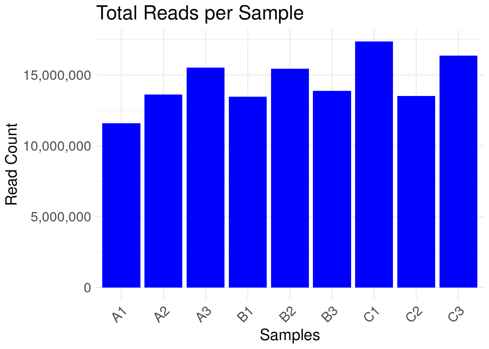

    Saving 7 x 5 in image
    * cleaning raw counts

    Not able to identify multiple id's in GeneName

    Columns that can be used to aggregate gene information GeneName

    Aggregating the counts for the same ID in different chromosome locations.
    Column used to Aggregate duplicate IDs: GeneName
    Number of rows before Collapse: 43280

    no duplicated IDs in GeneName

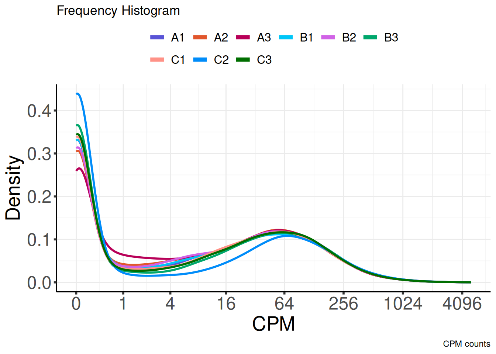

    Saving 7 x 5 in image
    * filtering clean counts

    Number of features after filtering: 7943

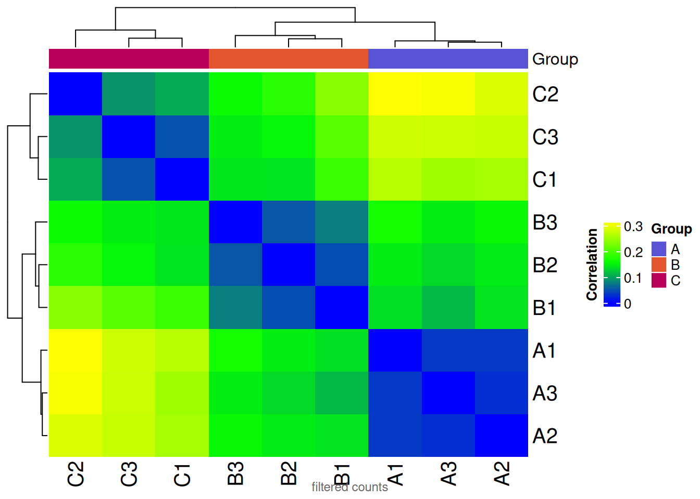

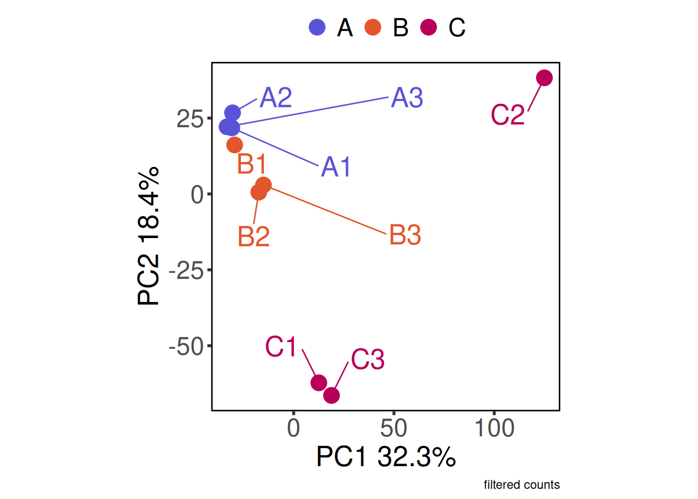

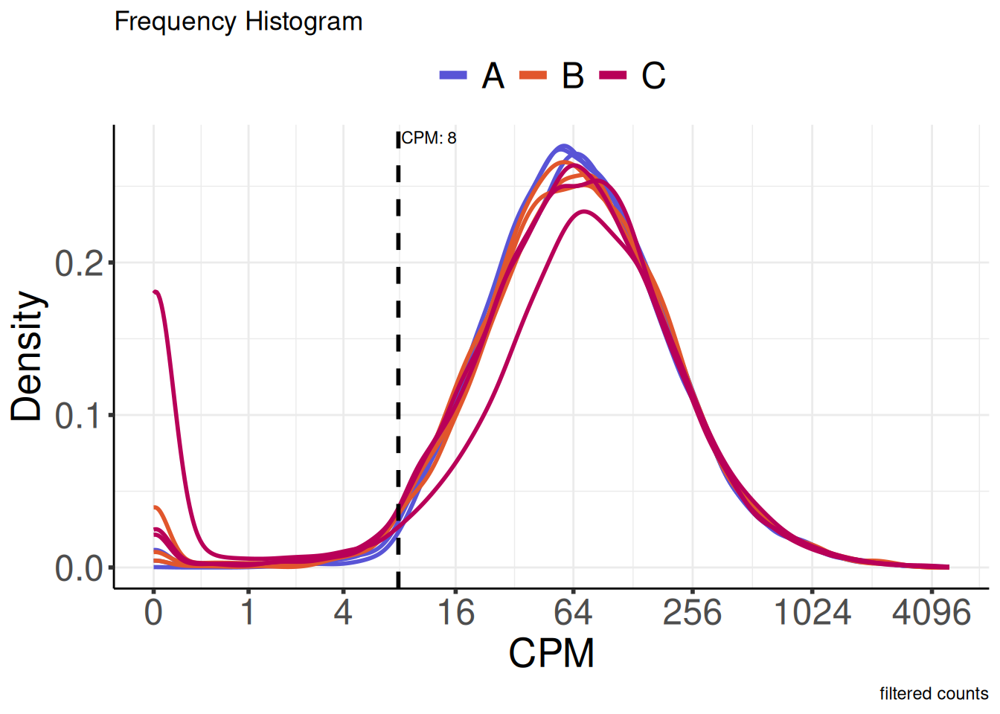

    Saving 7 x 5 in image
    * normalizing filt counts

    Total number of features included: 7943

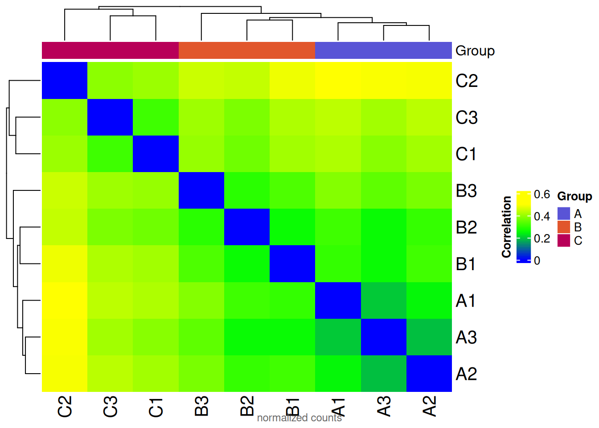

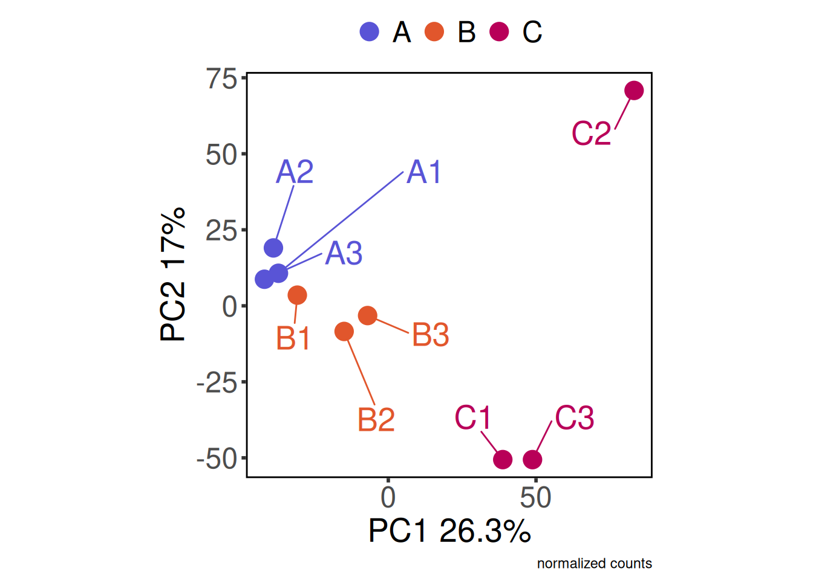

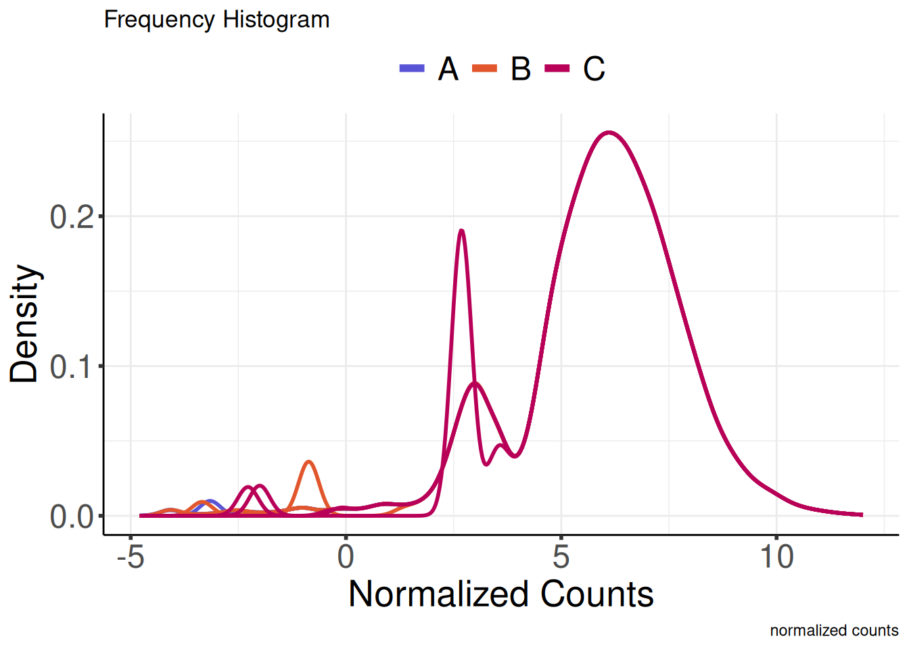

    Saving 7 x 5 in image
    Sample columns: A1, Sample columns: A2, Sample columns: A3, Sample columns: B1, Sample columns: B2, Sample columns: B3, Sample columns: C1, Sample columns: C2, Sample columns: C3

    * batch-correcting norm-voom counts

    Found2batches

    Adjusting for2covariate(s) or covariate level(s)

    Standardizing Data across genes

    Fitting L/S model and finding priors

    Finding parametric adjustments

    Adjusting the Data

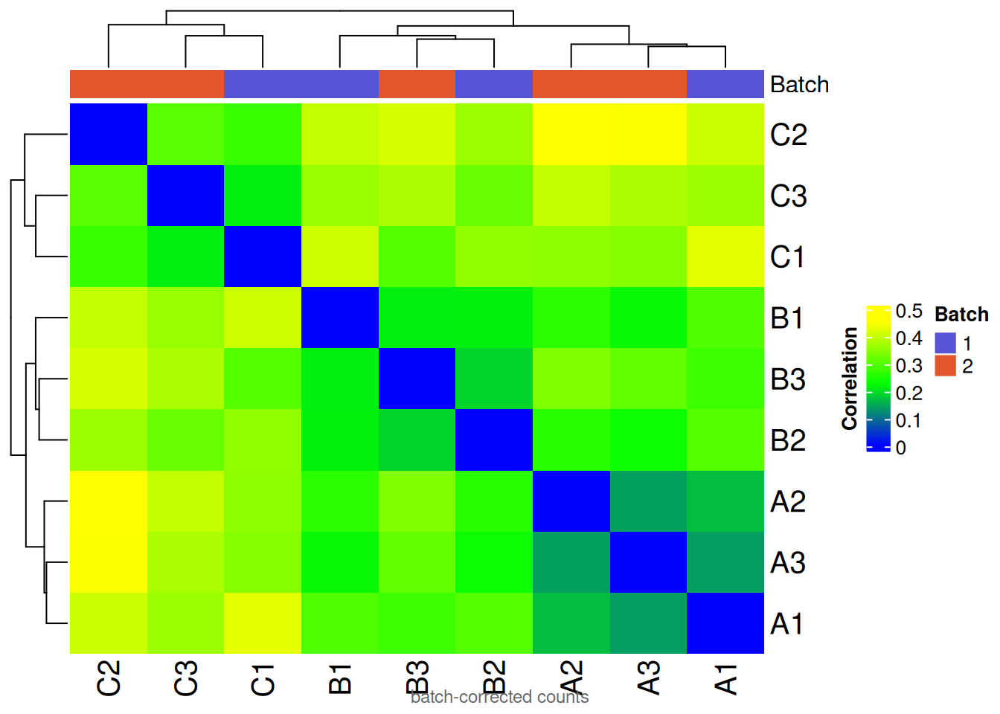

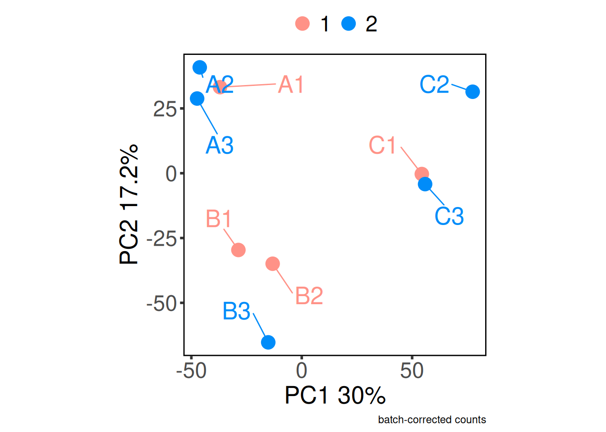

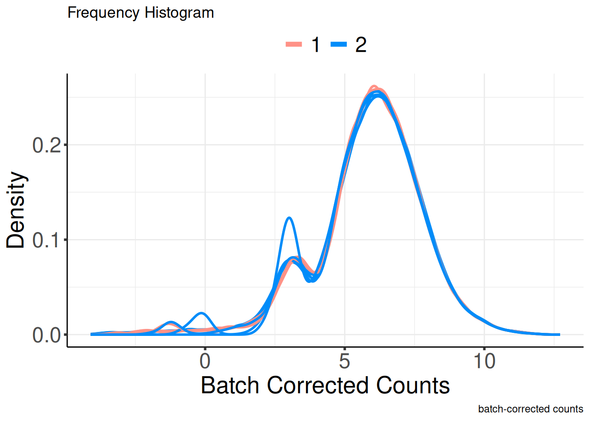

    Saving 7 x 5 in image
    The total number of features in output: 7943

    Number of samples after batch correction: 10

    * differential counts

    Setting first column of `counts` as gene annotation.

    Total number of genes included: 7943

    `geom_smooth()` using method = 'gam' and formula = 'y ~ s(x, bs = "cs")'

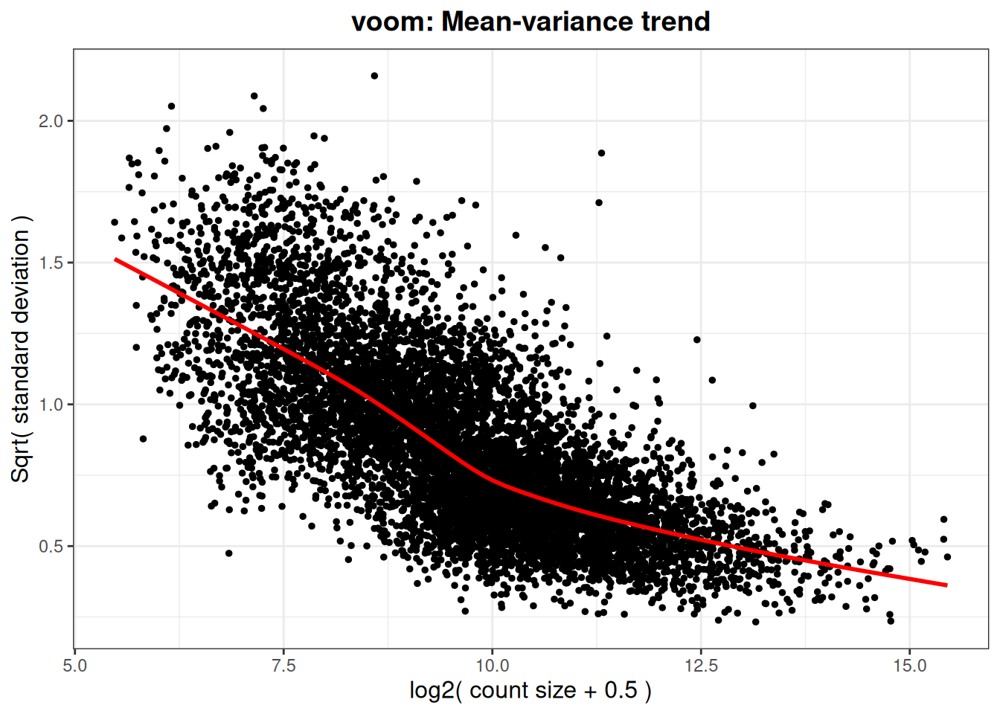

    Saving 7 x 5 in image
    `geom_smooth()` using method = 'gam' and formula = 'y ~ s(x, bs = "cs")'
    Joining with `by = join_by(GeneName)`
    Joining with `by = join_by(GeneName)`
    * filtering differential features

    Total number of genes selected with adjpval < 0.05 and | logFC | ≥ 1 is sum(selgenes)

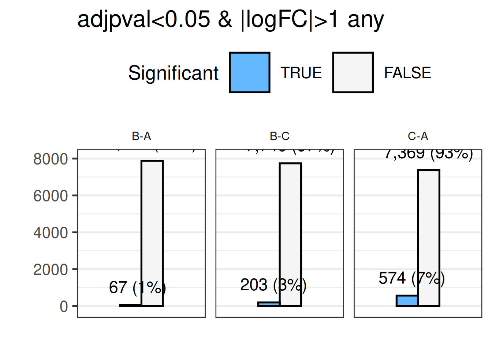

    Saving 7 x 5 in image

``` r
moo@analyses$diff |>
  join_dfs_wide() |>
  head() |>
  kable()
```

    Joining with `by = join_by(GeneName)`
    Joining with `by = join_by(GeneName)`

| GeneName |   B-A_FC | B-A_logFC | B-A_tstat |  B-A_pval | B-A_adjpval |    C-A_FC |  C-A_logFC |  C-A_tstat |  C-A_pval | C-A_adjpval |    B-C_FC |  B-C_logFC |  B-C_tstat |  B-C_pval | B-C_adjpval |
|:---------|---------:|----------:|----------:|----------:|------------:|----------:|-----------:|-----------:|----------:|------------:|----------:|-----------:|-----------:|----------:|------------:|
| Mrpl15   | 1.056918 | 0.0798634 | 0.2296406 | 0.8223259 |   0.9682828 | -1.070209 | -0.0978926 | -0.2970416 | 0.7716284 |   0.8894274 |  1.131123 |  0.1777559 |  0.5275092 | 0.6076722 |   0.8359440 |
| Lypla1   | 1.365417 | 0.4493421 | 1.1181111 | 0.2858929 |   0.7838255 | -1.071684 | -0.0998797 | -0.2548947 | 0.8032178 |   0.9068122 |  1.463296 |  0.5492218 |  1.3957137 | 0.1886550 |   0.4856181 |
| Tcea1    | 1.083512 | 0.1157146 | 0.3646249 | 0.7218792 |   0.9500829 | -1.178162 | -0.2365376 | -0.7638738 | 0.4600300 |   0.6896976 |  1.276552 |  0.3522522 |  1.1310868 | 0.2806110 |   0.5880985 |
| Atp6v1h  | 1.312326 | 0.3921258 | 1.1284456 | 0.2816801 |   0.7806646 | -1.221292 | -0.2884077 | -0.8323447 | 0.4218350 |   0.6585368 |  1.602732 |  0.6805335 |  1.9895488 | 0.0704671 |   0.3155517 |
| Rb1cc1   | 1.517238 | 0.6014477 | 1.3139591 | 0.2139732 |   0.7170238 |  1.312261 |  0.3920542 |  0.9026838 | 0.3848531 |   0.6279896 |  1.156202 |  0.2093934 |  0.4952214 | 0.6295889 |   0.8474567 |
| Pcmtd1   | 1.117922 | 0.1608194 | 0.2599816 | 0.7993845 |   0.9653317 |  3.252260 |  1.7014427 |  3.4089997 | 0.0053434 |   0.0568172 | -2.909202 | -1.5406233 | -2.9434322 | 0.0125596 |   0.1421555 |

``` r
moo@analyses$diff_filt |> head() |> kable()
```

| GeneName | B-A_FC | B-A_logFC | B-A_tstat | B-A_pval | B-A_adjpval | C-A_FC | C-A_logFC | C-A_tstat | C-A_pval | C-A_adjpval | B-C_FC | B-C_logFC | B-C_tstat | B-C_pval | B-C_adjpval |
|:---------|-------:|----------:|----------:|---------:|------------:|-------:|----------:|----------:|---------:|------------:|-------:|----------:|----------:|---------:|------------:|
| Rrs1     |  -2.06 |    -1.040 |    -2.860 |   0.0146 |       0.274 |  -2.71 |     -1.44 |     -3.84 | 2.45e-03 |     0.03640 |   1.32 |     0.400 |     0.945 | 3.64e-01 |     0.66400 |
| Mcm3     |  -1.45 |    -0.540 |    -1.850 |   0.0895 |       0.549 |  -2.46 |     -1.30 |     -4.31 | 1.07e-03 |     0.02290 |   1.69 |     0.756 |     2.360 | 3.62e-02 |     0.23400 |
| Ogfrl1   |   1.07 |     0.102 |     0.293 |   0.7750 |       0.960 |  -3.77 |     -1.92 |     -4.03 | 1.74e-03 |     0.03050 |   4.05 |     2.020 |     4.010 | 1.79e-03 |     0.05570 |
| Smap1    |   2.96 |     1.570 |     2.010 |   0.0686 |       0.500 |   5.68 |      2.51 |      3.59 | 3.81e-03 |     0.04690 |  -1.92 |    -0.938 |    -1.740 | 1.07e-01 |     0.38000 |
| Plekhb2  |  -1.24 |    -0.312 |    -1.100 |   0.2950 |       0.789 |   2.69 |      1.43 |      5.98 | 7.03e-05 |     0.00461 |  -3.34 |    -1.740 |    -6.970 | 1.69e-05 |     0.00334 |
| Il18r1   |   2.42 |     1.280 |     0.716 |   0.4880 |       0.873 |  36.60 |      5.19 |      3.16 | 8.41e-03 |     0.07450 | -15.10 |    -3.920 |    -4.210 | 1.26e-03 |     0.04690 |

## Visualization

### 3D PCA

``` r
plot_pca(
  moo@counts$batch,
  moo@sample_meta,
  principal_components = c(1, 2, 3),
  group_colname = group_colname,
  label_colname = label_colname,
  color_values = moo@analyses[["colors"]][[group_colname]]
)
```

### Expression Heatmap

``` r
heatmap_plot <- plot_expr_heatmap(
  moo,
  count_type = "norm",
  sub_count_type = "voom"
)
```

    The total number of genes in heatmap: 500

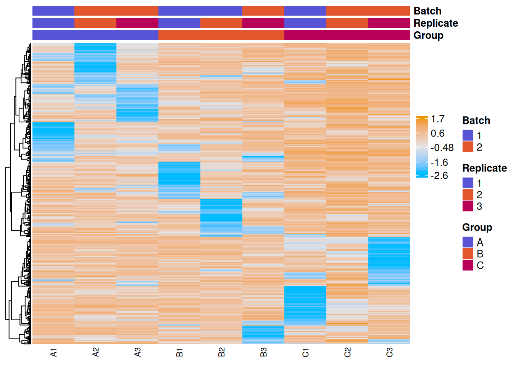

``` r
print(heatmap_plot)
```


### Volcano

#### Summary

``` r
dat_volcano_summary <- moo@analyses$diff |>
  join_dfs_wide() |>
  plot_volcano_summary()
```

    Joining with `by = join_by(GeneName)`
    Joining with `by = join_by(GeneName)`
    Preparing table for contrast: B-A
    Fold change column: B-A_logFC
    pval column: B-A_pval
    Total number of features included in volcano plot: 7943

    Warning in ggrepel::geom_text_repel(data = grm[custom_gene_list_ind, ], :
    Ignoring unknown parameters: `segment.linewidth`

    Preparing table for contrast: C-A
    Fold change column: C-A_logFC
    pval column: C-A_pval
    Total number of features included in volcano plot: 7943

    Warning in ggrepel::geom_text_repel(data = grm[custom_gene_list_ind, ], :
    Ignoring unknown parameters: `segment.linewidth`

    Preparing table for contrast: B-C
    Fold change column: B-C_logFC
    pval column: B-C_pval
    Total number of features included in volcano plot: 7943

    Warning in ggrepel::geom_text_repel(data = grm[custom_gene_list_ind, ], :
    Ignoring unknown parameters: `segment.linewidth`

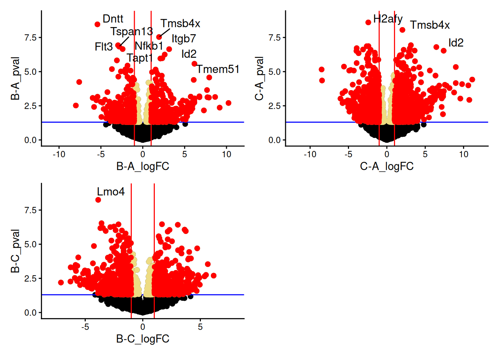

    Saving 7 x 5 in image

``` r
head(dat_volcano_summary)
```

          GeneName Contrast         FC     logFC     tstat         pval
    B-A.1     Dntt      B-A -42.727551 -5.417095 -15.54572 3.460410e-09
    B-A.2   Tmsb4x      B-A   3.845863  1.943307  12.82926 2.930649e-08
    B-A.3     Flt3      B-A  -7.743692 -2.953022 -11.29797 1.173487e-07
    B-A.4  Tspan13      B-A  -7.035795 -2.814713 -11.06018 1.476477e-07
    B-A.5    Tapt1      B-A  -5.297586 -2.405335 -10.64544 2.226279e-07
    B-A.6    Itgb7      B-A   8.882141  3.150907  10.62882 2.263833e-07
               adjpval
    B-A.1 2.748604e-05
    B-A.2 1.163907e-04
    B-A.3 2.931915e-04
    B-A.4 2.931915e-04
    B-A.5 2.996937e-04
    B-A.6 2.996937e-04

#### Enhanced

``` r
dat_volcano_enhanced <- moo@analyses$diff |>
  join_dfs_wide() |>
  plot_volcano_enhanced()
```

    Joining with `by = join_by(GeneName)`
    Joining with `by = join_by(GeneName)`
    Genes in initial dataset: 7943
    Max y: 4.56088783571366

    Warning: Using `size` aesthetic for lines was deprecated in ggplot2 3.4.0.
    ℹ Please use `linewidth` instead.
    ℹ The deprecated feature was likely used in the EnhancedVolcano package.
      Please report the issue to the authors.

    Warning: The `size` argument of `element_line()` is deprecated as of ggplot2 3.4.0.
    ℹ Please use the `linewidth` argument instead.
    ℹ The deprecated feature was likely used in the EnhancedVolcano package.
      Please report the issue to the authors.

    Genes in initial dataset: 7943

    Max y: 4.34744066227962

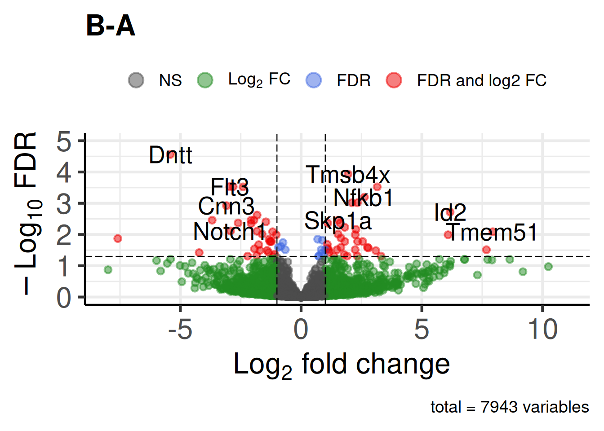

### Venn Diagram

``` r
venn_dat <- dat_volcano_summary |> plot_venn_diagram()
```

    All intersections: 1:7,c(1, 2, 3, 4, 5, 6, 7),c(80, 119, 264, 493, 152, 270, 516),c("Yes", "Yes", "Yes", "Yes", "Yes", "Yes", "Yes")

    Intersections returned: 1:7,c(1, 2, 3, 4, 5, 6, 7),c(80, 119, 264, 493, 152, 270, 516)

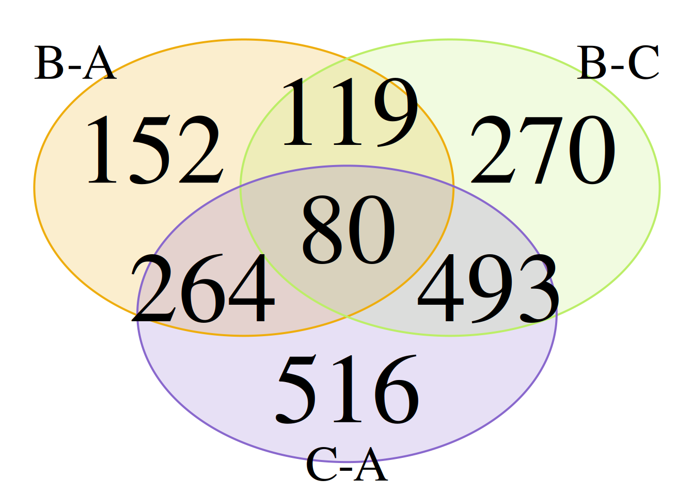

``` r
head(venn_dat)
```

       Gene      Intersection Id Size
    1  Dntt (B-A ∩ B-C ∩ C-A)  1   80
    2  Flt3 (B-A ∩ B-C ∩ C-A)  1   80
    3   Id2 (B-A ∩ B-C ∩ C-A)  1   80
    4 Eltd1 (B-A ∩ B-C ∩ C-A)  1   80
    5 Runx3 (B-A ∩ B-C ∩ C-A)  1   80
    6 Dusp6 (B-A ∩ B-C ∩ C-A)  1   80
